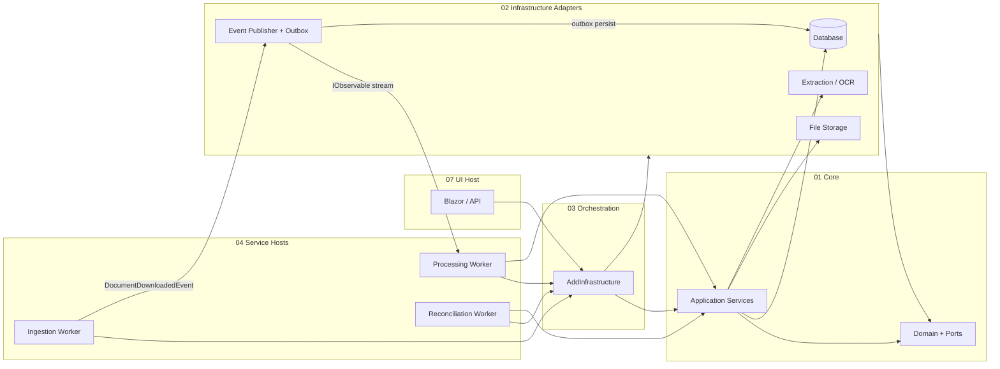

# Architectural & Solution Guidelines

> **Source:** Extracted from the ExxerCube.Prisma codebase (re-grounded against the live solution, June 2026).
> **Purpose:** A highly opinionated, project-agnostic guide for building enterprise .NET systems with the same architectural discipline observed in this repository.
> **Audience:** Architects and senior engineers starting a new solution or refactoring an existing one.
> **Method:** Synthesized from direct inspection of `Prisma/Code/Src/CSharp/` — `Directory.Build.props`, `Directory.Packages.props`, the layer folders, the NetArchTest suite, the ADR set, and the worker hosts. Concrete type/file names are cited as evidence; the *guidance* is deliberately transferable.

---

## Table of Contents

1. [Executive Summary](#1-executive-summary)
2. [Logical Architecture](#2-logical-architecture)
3. [Physical Architecture & Deployment](#3-physical-architecture--deployment)
4. [Technology Stack](#4-technology-stack)
5. [Coding Style & Conventions](#5-coding-style--conventions)
6. [Solution Patterns & Best Practices](#6-solution-patterns--best-practices)
7. [Testing Strategy](#7-testing-strategy)
8. [Observability & Operations](#8-observability--operations)
9. [Security & Configuration](#9-security--configuration)
10. [Build, Packaging & Repository Hygiene](#10-build-packaging--repository-hygiene)
11. [Anti-Patterns to Reject](#11-anti-patterns-to-reject)
12. [Adoption Checklist for a New Project](#12-adoption-checklist-for-a-new-project)

---

## 1. Executive Summary

**Adopt Hexagonal (Ports & Adapters) Clean Architecture with a dedicated composition layer.** Infrastructure projects must not reference each other. Do not put MediatR/CQRS in by default — use explicit application services and orchestrators. Treat `Result<T>` as the primary error model for business logic. Enforce the architecture with automated tests, not documentation alone.

The observed system demonstrates that **architecture is code**: layering rules, interface placement, stub detection, dependency direction, domain-event inheritance, and contract-base abstractness are all validated in CI by a **20-rule NetArchTest suite**. Testing mirrors the production folder structure 1:1. Workers are small, independently deployable hosts; the UI is a separate composition root. Multiple **bounded contexts** (here: a primary processing domain plus a `Veriqan` verification domain) coexist in one repository, each with its own Domain/Application/Infrastructure/Orchestration stack and its own composition-root extension method.

**Core stance:** Prefer boring, explicit, testable structure over framework magic. When a cross-cutting capability outgrows the repo (real-time/SignalR here), **extract it to a versioned NuGet package** and consume it through an abstraction (see `IndFusion.Ember`, ADR-009).

---

## 2. Logical Architecture

### 2.1 Layer Model

Use **numbered folders** to encode dependency direction. Numbers are not decorative — they communicate where code belongs and what it may depend on.

```
┌─────────────────────────────────────────────────────────────────────┐
│  07 UI — Blazor Server / API / real-time clients                    │
│  Composes services via DI; maps HTTP/UI errors at the boundary       │
└───────────────────────────────┬─────────────────────────────────────┘
                                │
┌───────────────────────────────▼─────────────────────────────────────┐
│  04 Services — Deployable worker hosts (Ingestion, Processing, …)   │
│  Each host: minimal API + IHostedService + health endpoints          │
└───────────────────────────────┬─────────────────────────────────────┘
                                │
┌───────────────────────────────▼─────────────────────────────────────┐
│  03 Orchestration — Composition root ONLY                           │
│  One AddXInfrastructure() extension wires every adapter in order     │
└───────────────────────────────┬─────────────────────────────────────┘
                                │
        ┌───────────────────────┴───────────────────────┐
        ▼                                               ▼
┌───────────────────────┐                   ┌───────────────────────────┐
│ 01 Core / Application │                   │ 02 Infrastructure         │
│ Use-case services     │                   │ One project per adapter     │
│ (declares NO ports)   │                   │ (DB, storage, OCR, export…) │
└───────────┬───────────┘                   └─────────────┬─────────────┘
            │                                               │
            └───────────────────┬───────────────────────────┘
                                ▼
                    ┌───────────────────────┐
                    │ 01 Core / Domain      │
                    │ Entities, VOs, Events │
                    │ Ports (interfaces)    │
                    │ SmartEnums, Specs     │
                    └───────────────────────┘
```

### 2.2 Dependency Rules (Non-Negotiable)

| Rule | Rationale | How it's enforced |
|------|-----------|-------------------|
| **All ports (`I*`) live in Domain** | Keeps the core ignorant of technology choices | `All_Interfaces_Should_Be_In_Domain_Layer` |
| **Application declares no interfaces** | Use cases consume ports; they don't define new ones | `Application_Layer_Should_Not_Contain_Interfaces` |
| **Application never references Infrastructure (or EF)** | Use cases depend on abstractions, not adapters | `Application_Should_Not_Depend_On_Infrastructure`, `Application_Should_Not_Reference_EntityFrameworkCore` |
| **Infrastructure projects never reference each other** | Prevents adapter coupling; composition happens one level up | `Infrastructure_Projects_Should_Not_Depend_On_Each_Other` |
| **Domain ports are implemented only in Infrastructure** | Adapters realize ports; the core stays abstract | `Domain_Interfaces_Should_Only_Be_Implemented_In_Infrastructure` |
| **Domain depends on nothing upward** | Dependency direction points inward | `Domain_Should_Not_Depend_On_Application/Infrastructure` |
| **Domain entities are persistence-agnostic** | No EF attributes; ORM config lives in Infrastructure | `Domain_Entities_Should_Not_Have_EF_Core_Attributes` |
| **Every domain port has a real (non-stub) implementation** | Stubs flagged by IL body-size detection | `All_Domain_Interfaces_Should_Have_At_Least_One_Implementation`, `No_Stub_Implementations_Should_Exist` |
| **Orchestration is the only place that wires adapters** | Breaks the "no cross-infra refs" rule safely, at the composition root | (Convention; the only project that references all adapters) |

> **Opinion — sanctioned exceptions belong in the test, not in your head.** The observed suite carries an explicit allow-list (e.g. CSnakes auto-generated interfaces, `IEnumModel`/`ILookupEntity`, one Application-side matcher). When reality must deviate, encode the exception *in the architecture test* with a comment — never by deleting the rule. A real example in this codebase is a single deliberate `Infrastructure.Database → Infrastructure.Calendar` reference (business-day calculation); the right disposition is to either lift the shared abstraction into Domain or whitelist it explicitly — not to silently normalize cross-adapter references.

### 2.3 Recommended Folder Convention

```
Code/Src/CSharp/
├── 01 Core/
│   ├── Domain/          # Entities, value objects, events, ports, SmartEnums, specifications
│   └── Application/     # Application services & orchestration logic (no ports, no EF)
├── 02 Infrastructure/
│   ├── Infrastructure.Database/
│   ├── Infrastructure.FileStorage/
│   ├── Infrastructure.{Capability}/   # One adapter per external concern
│   └── ...
├── 03 Orchestration/    # Composition root(s): AddXInfrastructure() extensions
├── 04 Services/
│   ├── {ServiceA}/      # Worker host + HealthChecks project + service-specific adapters
│   └── {ServiceB}/
├── 07 UI/               # Web host (separate composition root)
├── 08 Tests/            # Mirrors 01–07 + 09 Architecture
└── 09 Testing/          # Shared fixtures, contracts, abstractions, QA harness
```

**Opinion:** Skip unused numbers (05–06 here), but never collapse layers into a single "Infrastructure" monolith. Split adapters by capability, not by team convenience. The real solution carries **16+ infrastructure adapter projects** precisely so each can be tested, replaced, and reasoned about in isolation.

### 2.4 Multiple Bounded Contexts in One Repo

When a second domain emerges, **replicate the stack, don't entangle it.** The observed repo hosts a `Veriqan` verification context alongside the primary processing context:

```
01 Core/    Domain, Application,    Veriqan.Domain, Veriqan.Application
02 Infra/   Infrastructure.*,       Veriqan.Infrastructure.{Persistence,ReferenceData,Extraction,Validation,Visual,Reporting}
03 Orch/    Orchestration,          Veriqan.Orchestration   ← its own AddVeriqan() composition root
04 Services/                        Veriqan.Worker (+ HealthChecks)
```

Each context gets its own Domain core, its own adapters, and its own `Add{Context}()` extension. They share the platform conventions (`Result<T>`, SmartEnums, architecture tests) but not each other's internals.

### 2.5 Domain Modeling Patterns

Adopt tactical DDD where it pays off — do not cargo-cult aggregates everywhere.

| Pattern | When to use | How it was applied |
|---------|-------------|-------------------|
| **Entities & Value Objects** | Concepts with identity vs. equality-by-value | Separate `Entities/` and `ValueObjects/` folders; VOs immutable (e.g. `FieldValue`, `ExtractedFields`, `ClassificationResult`) |
| **SmartEnums** (`EnumModel` base) | Finite state with behavior, display names, DB persistence | Sealed class + static readonly instances + `FromValue`/`FromName` + implicit `int` conversions; pair with EF value converters |
| **Domain Events** | Cross-cutting reactions without tight coupling | `abstract record DomainEvent` with `EventId`/`Timestamp`/`CorrelationId`; `[JsonPolymorphic]` `$type` discriminator |
| **Specification** | Composable query predicates with paging/ordering/includes | `ISpecification<T>` in Domain; `SpecificationEvaluator<T>` in Infrastructure.Database |
| **Repository** | Aggregate persistence behind a port | Generic `IRepository<T, TId>` returning `Result<T>`; EF implementation isolated |
| **Strategy** | Pluggable algorithms (e.g., adaptive extraction) | Register multiple `I{X}Strategy` implementations in DI; resolver selects at runtime |
| **Source Types** | Polymorphic input handling | Discriminated types per input format (`Domain.Sources`) |

### 2.6 Application Layer: Services, Not CQRS

**Do not default to MediatR.** The observed codebase uses:

- **Application services** — one class per cohesive use case (`DocumentIngestionService`, `FileMetadataQueryService`, `DecisionLogicService`, `ExportService`, `FieldMatchingService`).
- **Service orchestrators** — coordinate multi-stage pipelines across ports (`ProcessingOrchestrator`, ingestion orchestrators).

Use CQRS only when read and write models genuinely diverge at scale. For most enterprise pipelines, explicit service classes are easier to navigate, test, and enforce architecturally. The architecture suite actively keeps this layer clean: it must declare no interfaces and must not touch EF.

### 2.7 Event-Driven Communication

Use **Rx.NET observables**, not classic `IEventHandler<T>` registration:

```
Domain logic publishes
    → IEventPublisher.Publish<TEvent>()
    → Subject<DomainEvent> (Infrastructure: EventPublisher)
    → IObservable streams: GetEventStream<TEvent>() / GetAllEventsStream()
    → Subscribers: orchestrators, persistence worker, UI broadcaster
```

**Rules:**
- Publish is fire-and-forget; subscriber errors are logged, never thrown upstream (a subscriber must never kill the `Subject`).
- Every event carries a `CorrelationId` for tracing across processes.
- Subscribers are registered at host startup (`StartAsync` on orchestrators / hosted workers).
- Pair the in-memory stream with an **outbox**: persist every event for an audit trail and replay unprocessed rows (`EventPersistenceWorker` → `OutboxEvents` + `AuditRecords`; `OutboxRetryWorker` rescues failures).
- Extract real-time UI plumbing into a dedicated package when it grows (here: `IndFusion.Ember`; consume via `IExxerHub<TEvent>`, ADR-009).

### 2.8 Composition Root Pattern

Create a single extension method that registers all infrastructure in dependency order:

```csharp
public static IServiceCollection AddPrismaInfrastructure(
    this IServiceCollection services,
    PythonConfiguration pythonConfiguration,
    string connectionString,
    Action<FileStorageOptions> configureFileStorage,
    IConfiguration? configuration = null)
{
    services.AddExtractionServices();          // each adapter ships its own Add*Services()
    services.AddTxtFieldExtraction();
    services.AddAdaptiveDocxExtraction();
    services.AddClassificationServices();
    services.AddDatabaseServices(connectionString, configuration);
    services.AddFileStorageServices(configureFileStorage);
    services.AddExportServices();
    services.AddMetricsServices(pythonConfiguration.MaxConcurrency);
    services.AddOcrProcessingServices(pythonConfiguration);
    return services;
}
```

**Opinion:** Every infrastructure project exposes its own `ServiceCollectionExtensions` (`AddDatabaseServices`, `AddFileStorageServices`, `AddExportServices`, …). Only the Orchestration project calls them all. Host `Program.cs` files call `Add{Product}Infrastructure()` plus host-specific services. Use `TryAdd*` semantics so a host can override a default, and branch on configuration where appropriate (e.g., real EF persistence when a connection string is present, in-memory otherwise — as `AddVeriqan()` does).

---

## 3. Physical Architecture & Deployment

### 3.1 Multi-Host Topology

Deploy as **multiple small hosts**, not one monolith. Each pipeline stage is an independently deployable worker:

| Host type | Responsibility | Shape |
|-----------|----------------|-------|
| **Web UI** | Human interaction, admin, dashboards | Blazor Server + REST + antiforgery + cookie auth |
| **Ingestion worker** (Orion) | Poll/watch external sources, download, emit domain events | `WebApplication` + `IHostedService` + health + SignalR hub |
| **Processing worker** (Athena) | Run the multi-stage pipeline on events | Same shape; hosts the `ProcessingOrchestrator` |
| **Reconciliation worker** (Reconciliator) | Cross-document conflict resolution + export | Same shape; subscribes to the processing hub |
| **Verification worker** (Veriqan) | Second bounded context's batch verification | Same shape; OpenTelemetry-instrumented |
| **Monitor service** (Sentinel) | Heartbeat, restart signaling | **Library-only** here — keep such pieces out of MVP until a host wraps them |

Each worker is a **minimal API + `IHostedService`**. Background work starts in `StartAsync`; the HTTP surface exists primarily for ops (health + dashboard). A worker that has domain logic but no `Program.cs`/DI registration (Sentinel) is **library-only** — track it honestly as not-yet-hosted rather than claiming it as a running service.

### 3.2 Health Checks

Standardize on three endpoints per host:

- `/health` — aggregate
- `/health/live` — process is running (liveness)
- `/health/ready` — dependencies reachable and the worker's real work loop is active (readiness)

Implement a per-service health type (`OrionHealthCheckService`, `AthenaHealthCheckService`, `ReconciliatorHealthCheckService`, `VeriqanWorkerHealthCheckService`) behind a shared `IHealthCheckService`/`IReadinessProbe` seam. Readiness should reflect *real* progress (e.g. "the poll loop is actually polling"), not just "the process is up."

### 3.3 Operator Dashboards

Each worker exposes an `IDashboardService` (singleton) at `/dashboard` for operator visibility — documents processed, last event time, last heartbeat, queue depth. Pair it with `/health/ready` for orchestrator routing. Keep dashboard counters honest: a stage that isn't wired yet should report that, not fabricate zeros that read as "healthy and idle."

### 3.4 Polyglot Sidecars

When ML/OCR/scripting is needed:

- Keep **Python (or other runtimes) as sidecar modules**, not embedded strings — isolate them in dedicated `Infrastructure.{Runtime}.{Module}` projects.
- Bridge via **CSnakes.Runtime** (or equivalent typed interop) with explicit MSBuild wiring (`<PythonRoot>` + a `SetPythonPathForCSnakes` target) and explicit timeout/concurrency config.
- Mirror the test structure: a `Testing.Python` / `Tests.Infrastructure.Python` validates the *bridge*, not the ML model itself.
- **Optionality by design is legitimate:** the observed system runs OCR directly in C# (Tesseract) and keeps the Python/VLM bridge *dormant but wired* so a model can be reactivated later (ADR-001). Document dormant scaffolding as a deliberate choice so nobody "cleans it up."
- Duplicate runtime trees are a known hazard; reconcile deliberately and record which copy the build depends on.

### 3.5 Containers & Orchestration

The observed repo ships **real container assets** — treat this as the target, not an afterthought:

- A **Dockerfile per host** (multistage, .NET 10): Orion, Athena, Reconciliator, Veriqan.Worker, Web UI, and the external-system simulator.
- **`docker-compose.dev.yml`** wires the full local topology (SQL Server, Seq, the source-system simulator, the workers, the UI) on a shared bridge network, with a shared document volume (one worker writes, others read) and SQL `service_healthy` dependencies.
- A **per-context compose file** (`docker-compose.veriqan.yml`) for the second domain.
- **Testcontainers** for integration tests (SQL Server, Ollama) — distinct from the production compose files.
- **Aspire is optional** — the observed pattern uses docker-compose as the orchestration layer and works without Aspire. Adopt Aspire when you need distributed dev orchestration, not before.

### 3.6 Artifacts Outside the Repo

Redirect `bin/`/`obj/` to an external `BuildArtifacts/` directory via `Directory.Build.props` (`ArtifactsBaseDir` → `BaseOutputPath`/`BaseIntermediateOutputPath`). Keeps git clean and avoids accidental commits of build output. Provide a `StrykerCompat` env-var escape hatch when a tool needs flattened output paths.

---

## 4. Technology Stack

### 4.1 Platform & Language

| Choice | Setting | Stance |
|--------|---------|--------|
| **.NET** | `net10.0` | Target the latest runtime centrally in `Directory.Build.props` |
| **C#** | `LangVersion=latest` | Use modern features; enforce style in build |
| **Nullable reference types** | `enable` | Combined with explicit null checks at boundaries |
| **Warnings as errors** | `true` | No warning debt accumulation |
| **Code style in build** | `EnforceCodeStyleInBuild=true` | `.editorconfig` is law |
| **XML docs** | `GenerateDocumentationFile=true` | Public APIs documented |

### 4.2 Core Libraries (Recommended Defaults, with the pinned versions observed)

| Concern | Library | Version | Why |
|---------|---------|---------|-----|
| **Business errors** | `IndQuestResults` (`Result<T>`) | 1.3.0 | Railway-oriented programming; no exceptions for expected failures |
| **ORM** | EF Core + SQL Server | 10.0.8 | Mature, testable with InMemory + Testcontainers |
| **DI** | Microsoft.Extensions.DependencyInjection | 10.0.8 | Native; per-adapter `ServiceCollectionExtensions` |
| **DI scanning** | Scrutor | 7.0.0 | Assembly scanning & decoration where registration is repetitive |
| **Resilience** | Polly | 8.6.6 | Transient fault handling at infrastructure boundaries |
| **Events** | System.Reactive | 6.1.0 | Observable streams for domain events |
| **Real-time UI** | Dedicated package (`IndFusion.Ember`) | 0.1.0 | Extract SignalR/hub logic into a NuGet; consume via abstraction |
| **Logging** | Serilog (+ Console/File/Seq/MSSqlServer sinks) | 4.3.1 | Structured logging with `{Property}` placeholders; SQL sink for durable audit |
| **Telemetry** | OpenTelemetry (+ ASP.NET/HTTP/EF/runtime instrumentation) | 1.15.x | Traces, metrics; OTLP export to Seq or vendor |
| **UI** | Blazor Server + MudBlazor | 8.11 | Component library; pin the major version until a migration budget exists |
| **Auth** | ASP.NET Core Identity (cookies) + JWT bearer | 10.0.8 | UI uses cookies; keep JWT-ready ports for workers/IdP swap |
| **Python interop** | CSnakes.Runtime | 1.2.1 | Typed bridge with MSBuild Python path targets |
| **OCR / CV** | Tesseract, Emgu.CV, SixLabors.ImageSharp | 5.2.0 / 4.12.x / 3.1.12 | Capability-specific; isolate in extraction/imaging adapters |
| **PDF** | PdfSharp, PdfPig, PDFtoImage | 6.2.4 / 0.1.14 / 5.2.1 | Native text + rasterization in extraction/export adapters only |
| **Excel / Office** | ClosedXML, DocumentFormat.OpenXml | 0.105.0 / 3.5.1 | Keep in Export/Extraction adapters only |
| **LLM** | OllamaSharp, Microsoft.Extensions.AI | 5.4.11 / 10.6.0 | Optional model integration behind a port |

> **Version-hold discipline:** several majors are deliberately held back with a recorded reason — MudBlazor `8.x` (9.x is a visual migration), ImageSharp `3.1.x` (4.x is a paid commercial license enforced at build), Emgu.CV `4.12` (4.13 changes a native signature), Testcontainers `4.9` (4.12 obsoletes ctors as errors). **Record why every held version is held**, so the next engineer doesn't "helpfully" bump it.

### 4.3 Central Package Management

**Always use** `Directory.Packages.props` with `ManagePackageVersionsCentrally=true`:

- Pin versions once; projects reference packages without version attributes.
- Enable `CentralPackageTransitivePinningEnabled` to override vulnerable transitive deps (e.g. pin `System.Security.Cryptography.Xml 10.0.8`).
- Document suppressions (`NU1902`, etc.) with advisory links in `Directory.Build.props` / a `SECURITY_SUPPRESSIONS.md`.
- Single, mapped NuGet source (`nuget.org` only, with `packageSourceMapping`) — no implicit private feeds.

### 4.4 Testing Stack

| Tool | Version | Role |
|------|---------|------|
| **xUnit v3** (`xunit.v3.mtp-v2`) + **Microsoft Testing Platform v2** | 3.2.2 / 2.1.0 | Test runner (executables, not VSTest); filter with `--filter-query` |
| **Shouldly** | 4.3.0 | Assertions (`value.ShouldBe(expected)`) |
| **NSubstitute** | 5.3.0 | Mocking |
| **NetArchTest.Rules** | 1.3.2 | Architecture constraint tests |
| **Testcontainers** (MsSql, Ollama) | 4.9.0 | Real SQL/Ollama in integration tests |
| **Stryker.NET** | 0.9.0 | Mutation testing on critical adapters |
| **coverlet** / MTP CodeCoverage | 6.0.4 / 18.5.2 | Coverage collection |
| **Playwright** | 1.60.0 | Browser E2E (category-filtered) |
| **Meziantou.Extensions.Logging.Xunit.v3** | 2.0.1 | Real logging in tests (don't mock `ILogger`) |

> **The xUnit v3 + MTP pairing is version-coupled and fragile.** Reference `xunit.v3.mtp-v2` (the MTP-v2 variant), align every `Microsoft.Testing.*` package to the same MTP minor, and add `global.json` `{ "test": { "runner": "Microsoft.Testing.Platform" } }`. Get it wrong and tests fail at *run* time with `MissingMethodException`, not at build. Bump the whole set together.

> **Banned in tests:** Moq. **Avoid** FluentAssertions even though it may appear pinned — pick one assertion library (Shouldly) and one mock library (NSubstitute) and enforce them consistently.

---

## 5. Coding Style & Conventions

### 5.1 Naming

| Element | Convention |
|---------|------------|
| Types, properties, methods | `PascalCase` |
| Locals, parameters | `camelCase` |
| Files | Match the primary type name (`FieldMatchingService.cs`) |
| Namespaces | `{Company}.{Product}.{Layer}.{Feature}` (e.g. `ExxerCube.Prisma.Domain.Interfaces`) |
| Ports | `I{Capability}` in `Domain.Interfaces` |
| DI extensions | `{Adapter}.DependencyInjection.ServiceCollectionExtensions` |
| Tests | `{ClassUnderTest}Tests`, `{Port}ContractTests`, methods `MethodUnderTest_Scenario_ExpectedBehavior` |

Use per-project `GlobalUsings.cs` for repetitive imports (Domain's includes `IndQuestResults`; test projects' include Shouldly/NSubstitute/Xunit/the Meziantou logger).

### 5.2 Async & Cancellation

Every async public method **must** accept `CancellationToken cancellationToken = default`.

```csharp
public async Task<Result<T>> ProcessAsync(Input input, CancellationToken cancellationToken = default)
{
    if (cancellationToken.IsCancellationRequested)
        return ResultExtensions.Cancelled<T>();

    // propagate cancellationToken to all downstream calls
}
```

- Use `ConfigureAwait(false)` in library and background-service code.
- **Never throw `OperationCanceledException`** for business flows — return `ResultExtensions.Cancelled<T>()`.
- In tests, use `TestContext.Current.CancellationToken` (xUnit v3), not a hand-rolled `CancellationTokenSource`.

### 5.3 Error Handling with Result\<T\>

```csharp
if (input is null)
    return Result<T>.WithFailure("Input cannot be null");   // validation → failure, not throw

return Result<T>.Success(value);                            // success

// Inspect: IsSuccess / IsFailure / IsCancelled() ; read .Value (after IsSuccess) and .Error
// Chain with functional operators: Map, Bind, Match, ThenAsync
```

| Layer | Pattern |
|-------|---------|
| Application / Infrastructure business logic | `Result<T>` exclusively |
| Constructor DI validation | `ArgumentNullException` for required dependencies |
| HTTP/UI boundary | Global exception middleware → structured JSON error |
| Event publishing | Swallow + log; never break the pipeline |
| Host startup DI failures | Fatal log + diagnostic file |

### 5.4 Null Safety

- Nullable reference types enabled with warnings-as-errors.
- Prefer **explicit null checks** at boundaries over relying solely on annotations.
- Use `IsSuccessMayBeNull` / `IsSuccessNotNull` on `Result` values where nullability is meaningful.

### 5.5 SmartEnums

When replacing primitive enums:

1. `sealed` class extending `EnumModel`.
2. Static readonly instances with display names (and an explicit `Unknown`/`Invalid` sentinel).
3. `FromValue` / `FromName` factory methods (+ implicit `int` conversions if ergonomic).
4. EF `HasConversion` + value comparer in the entity configuration (required for EF InMemory too).
5. Mirror in JSON serializers and cache keys when the enum surfaces externally.

### 5.6 Documentation & Style Enforcement

- `GenerateDocumentationFile=true` — XML docs on public APIs.
- `EnforceCodeStyleInBuild=true` — `.editorconfig` is enforced at build.
- Keep methods small (~50 lines), favor **pure functions** and **observable streams** over event delegates, and keep side effects in Infrastructure or host startup — not in Domain.

---

## 6. Solution Patterns & Best Practices

### 6.1 Defensive Intelligence

Pipelines should be **tolerant and observable**, not brittle:

- Missing optional fields → warnings/flags, not hard stops.
- Non-critical step failure → log + continue when safe.
- Always measure duration with `Stopwatch` and log elapsed ms.

### 6.2 Dual Database Pattern (When Identity/Audit ≠ App Data)

Separate connection strings and databases:

- `DefaultConnection` — Identity + audit/structured-log tables (here: DB `PrismaID`, also the Serilog MSSqlServer sink target).
- `ApplicationConnection` — domain data (here: DB `Prisma`).

This keeps auth/audit schema migrations independent from business schema and lets the durable audit ledger live next to identity.

### 6.3 Adapter Isolation

Each external capability gets its own infrastructure project:

```
Infrastructure.Database        Infrastructure.Export(.Adaptive)
Infrastructure.FileStorage     Infrastructure.Imaging
Infrastructure.Events          Infrastructure.Metrics
Infrastructure.Identity        Infrastructure.BrowserAutomation
Infrastructure.Extraction.Ocr  Infrastructure.Calendar
Infrastructure.Extraction.Txt  Infrastructure.Python.{Module}
Infrastructure.Classification
```

**Never** import one adapter from another. Shared code goes in Domain (ports/models) or a thin `CrossConcerns` library with zero adapter references. The architecture test `Infrastructure_Projects_Should_Not_Depend_On_Each_Other` is what keeps this true over time.

### 6.4 Strategy Registration

For pluggable algorithms, register all implementations and let a resolver/composite pick at runtime:

```csharp
services.AddScoped<IAdaptiveStrategy, StructuredStrategy>();
services.AddScoped<IAdaptiveStrategy, SearchExtractionStrategy>();
// ... all strategies registered; resolver selects based on input
```

### 6.5 ITDD — Interface-Driven Test-Driven Development (ADR-005)

Define a port's behavioural **contract** as an `abstract` base test class, then inherit it once per implementation (and once for a mock/blueprint instance). This is the mandatory shape (`docs/architecture/adr/ADR-005-itdd-contract-tests-injected-sut.md`):

```
Testing.Contracts/                 (non-runnable lib: Shouldly + xunit extensibility + NSubstitute)
  {Name}Contract.cs                // abstract base — NOT discovered by xUnit
  {Name}MockFactory.cs             // reference-fake SUT (the executable design spec)
Tests.Domain.Interfaces/           (runnable)
  Mock{Name}ContractTests.cs       // blueprint instance (SUT from the mock factory)
Tests.Infrastructure.<Adapter>/    (runnable)
  {ImplName}ContractTests.cs       // one instance per real implementation
```

- **N + 1 inheritors:** 1 blueprint (mock) + N real implementations, all running the identical `[Fact]`/`[Theory]` bodies once per deriving class (xUnit v3 + MTP discover inherited facts natively).
- **SUT mechanism:** constructor-injected interface-typed `Sut` by default; `protected abstract T CreateSut()` only where construction needs a per-implementation fixture (EF context, files).
- **Scope rule:** a test belongs in the base iff *any* correct implementation must pass it (Result semantics, null/empty handling, **cancellation**, ordering, XML-doc'd behaviour). Implementation richness (fixtures, format specifics, confidence tiers, and **all `*MutationTests`**) stays in the implementation's project — alongside, never inside, the contract.
- The mock/blueprint class is the **design spec, authored first** and **never deleted**.

Architecture tests verify every `I*` in Domain has a non-stub implementation (IL body size) and that every `*Contract` is `abstract` with ≥ 1 inheriting test class (`Contract_Bases_Must_Be_Abstract_With_At_Least_One_Inheritor`).

### 6.6 ADR Discipline

Record significant decisions in `docs/architecture/adr/ADR-NNN-{title}.md` (Context → Decision → Consequences). The observed set spans **ADR-001 through ADR-022**; notable ones to emulate:

- **ADR-001** — sidecar runtime choice (CSnakes vs Python.NET) and the dormant-by-design VLM scaffold.
- **ADR-003** — placing a cross-cutting capability (metrics) in Infrastructure.
- **ADR-005** — the ITDD contract-test shape (above).
- **ADR-008** — strategy-based adaptive extraction.
- **ADR-009** — extracting real-time comm to the `IndFusion.Ember` NuGet package.

### 6.7 Fixture-Driven Testing

Maintain a `Fixtures/` tree with real representative inputs and **negative mirrors** (missing fields, blank values, degraded scans) to validate reconciliation behaviour. The observed fixtures pair clean sets with `*_Degraded` variants so failure paths are exercised against realistic data.

---

## 7. Testing Strategy

### 7.1 Test Pyramid

```
                    ┌─────────────┐
                    │  E2E / UI   │  Playwright, WebApplicationFactory, full host boot
                    │  (few)      │
                ┌───┴─────────────┴───┐
                │  System Tests     │  Full pipeline + Testcontainers (SQL/Ollama)
                │  (some)           │
            ┌───┴───────────────────┴───┐
            │  Integration / Infra Tests  │  Per-adapter, real DB/container
            │  (many)                   │
        ┌───┴───────────────────────────┴───┐
        │  Unit + Contract + Architecture   │  Domain, Application, ITDD contracts, NetArchTest
        │  (most)                           │
        └───────────────────────────────────┘
```

### 7.2 Mirror Production Structure

`08 Tests/` subfolders map 1:1 to production layers:

| Test folder | Mirrors |
|-------------|---------|
| `01 Core` | Domain + Application (+ `Tests.Domain.Interfaces` blueprint contracts) |
| `02 Infrastructure` | Each adapter project |
| `03 Orchestration` | DI composition resolution |
| `04 Services` | Worker hosts, health checks |
| `05 System` | End-to-end pipeline + Testcontainers (storage, integration) |
| `06 E2E` | Full host boot + all-real-wire scenarios |
| `07 UI` | Blazor services via `WebApplicationFactory` / Playwright |
| `08 Console` | Demo/console apps |
| `09 Architecture` | NetArchTest rules |

Shared test infrastructure (contracts, abstractions, fixtures, QA harness) lives in `09 Testing/`.

### 7.3 Architecture Tests (Mandatory)

Enforce in CI with NetArchTest. The observed suite (`HexagonalArchitectureTests.cs`) is **20 rules**, including:

1. All interfaces in `Domain.Interfaces`.
2. Application declares no interfaces.
3. Infrastructure does not declare domain ports.
4. Domain ports implemented only in Infrastructure.
5. Domain does not depend on Application or Infrastructure.
6. Application does not depend on Infrastructure or reference EF Core.
7. **No cross-infrastructure dependencies.**
8. Domain entities carry no EF/data-annotation attributes.
9. Every domain event inherits from `DomainEvent`.
10. Every domain interface has at least one implementation (allow-listed exceptions).
11. **No stub implementations** (IL body-size detection of empty/throw-only methods).
12. No duplicate class/interface names across layers.
13. Test assemblies respect infrastructure dependency boundaries.
14. Contract bases are `abstract` with ≥ 1 inheriting test class.

**Opinion:** If you only write one "special" test project, make it architecture tests. Encode sanctioned exceptions *in the test* with comments, never by relaxing the rule globally.

### 7.4 Test Naming & Execution

```
MethodUnderTest_Scenario_ExpectedBehavior
```

```bash
# Full solution
dotnet test "Code/Src/CSharp/Product.sln"

# Single test (xUnit v3 filter-query)
dotnet test Tests.Application.csproj --filter-query "/Namespace/ClassName/MethodName"

# Category filter
dotnet test Tests.E2E.csproj --filter-query "[category=E2E]"
```

> Because test projects build as **MTP executables** (not VSTest assemblies), `dotnet test` requires the `global.json` MTP runner opt-in; you can also run the produced executable directly.

### 7.5 Mutation Testing

Configure `stryker-config.json` per critical adapter/project (`test-runner: mtp`, `coverage-analysis: perTest`, HTML reporter, explicit `mutate` globs). Set the `StrykerCompat` env var when build-output paths must be flattened for Stryker's binary resolution.

### 7.6 Container Sharing & Isolation

Share one SQL container per assembly (xUnit v3 `[assembly: AssemblyFixture]`), but give each write-heavy test class **its own database** on that shared container (cheap `CREATE DATABASE`, dropped on disposal) so classes can run in parallel without colliding. Don't reintroduce a shared mutable database across parallel classes.

---

## 8. Observability & Operations

### 8.1 Structured Logging

```csharp
_logger.LogInformation("Processing {DocumentId} stage {Stage} in {ElapsedMs}ms",
    documentId, stage, stopwatch.ElapsedMilliseconds);
```

- Serilog with configuration binding; Console + File + **Seq** sinks for centralized search, **MSSqlServer** sink for durable audit.
- Correlation scopes via `LogBeginScope` dictionaries; never concatenate strings into messages.

### 8.2 OpenTelemetry

Instrument ASP.NET Core requests, HTTP client calls, EF Core queries, runtime/process metrics, and custom meters (`Meter`, `Counter<long>`, `Histogram<double>`) via a metrics service. Export to a Seq OTLP endpoint or your vendor of choice.

### 8.3 Audit Trail via Outbox

Persist every domain event (outbox pattern) to an `OutboxEvents` table plus an `AuditRecords` ledger; a retry worker re-publishes unprocessed rows. This gives a durable, replayable audit trail decoupled from the in-memory Rx stream.

---

## 9. Security & Configuration

### 9.1 Secrets

- **Never** commit credentials, tokens, or connection strings.
- Use environment variables, user-secrets, or Key Vault (`Azure.Identity`, `Azure.Security.KeyVault.Certificates` on Azure).
- Document required variables in `README`/`.env.example`, not in code. (Watch for demo `appsettings.json` that hardcode a developer's SQL instance — keep those out of any deployable path.)

### 9.2 Authentication Pattern

- **Production UI:** ASP.NET Core Identity with cookies, antiforgery enabled.
- **API/workers:** JWT-ready ports (`ITokenService`, `IIdentityProvider`, `IUserContextAccessor`) even if not fully wired on day one; SignalR hubs authenticate with JWT bearer.
- **Dev/test:** an in-memory identity adapter — never in production.

### 9.3 Storage & Transport

- Encrypt sensitive artifacts at rest (the file-storage adapter uses AES-256-GCM).
- `UseHsts()` in non-development environments; `UseAntiforgery()` on interactive UI.
- Global exception handler middleware — structured JSON, no stack traces to clients in production.

### 9.4 Configuration Binding

- `appsettings.json` per host with environment overlays and `ConnectionStrings__*` env injection (compose-friendly).
- `IOptions<T>` with `ValidateOnStart` for critical settings; a startup `IHostedService` validator can fail fast on misconfiguration.
- Sidecar/runtime config (module path, concurrency, operation timeout) lives in typed options.

---

## 10. Build, Packaging & Repository Hygiene

### 10.1 Build Commands

```bash
dotnet restore "Code/Src/CSharp/Product.sln"
dotnet build   "Code/Src/CSharp/Product.sln"   # TreatWarningsAsErrors is implied
dotnet test    "Code/Src/CSharp/Product.sln"    # MTP runner via global.json
```

`dotnet list package --vulnerable` should report clean; CVEs are cleared by `CentralPackageTransitivePinningEnabled` pins, not by ignoring them.

### 10.2 Repository Layout

```
{RepoRoot}/
├── Prisma/Code/Src/{CSharp,Python}/   # Product source
├── docs/                              # Architecture, ADRs, planning, QA, reference
│   └── architecture/adr/             # ADR-NNN-{title}.md
├── scripts/                           # Operational automation (docker, db, generators)
├── tools/                             # Standalone dev tools (e.g. external-system simulator)
├── Fixtures/                          # Test inputs (+ degraded mirrors)
├── docker-compose.*.yml               # Local topology per environment/context
├── AGENTS.md / CLAUDE.md              # Contributor + agent guidelines
├── coverage.runsettings               # Coverlet configuration
└── run-coverage[-ci].ps1              # Coverage orchestration
```

### 10.3 Commit & PR Standards

- **Conventional Commits:** `feat:`, `fix:`, `refactor:`, `test:`, `docs:`, `chore:` — present-tense, scoped subjects.
- PRs include: behaviour summary, linked requirement, test evidence (`dotnet test …`), screenshots for UI.
- Call out breaking changes explicitly: EF migrations, SmartEnum changes, serializer/cache impacts.
- Do not add or remove solution projects without architectural review (it changes what the layering tests must assert).

---

## 11. Anti-Patterns to Reject

| Anti-pattern | Why it fails here |
|--------------|-------------------|
| MediatR for everything | Hides use-case entry points; harder to enforce layering |
| Throwing exceptions for validation | Bypasses the `Result<T>` contract; untestable flows |
| Monolithic Infrastructure project | Cross-adapter coupling; untestable in isolation |
| One adapter referencing another | Breaks `Infrastructure_Projects_Should_Not_Depend_On_Each_Other`; lift shared code into Domain instead |
| EF attributes on domain entities | Breaks persistence ignorance; fails architecture tests |
| `IEventHandler<T>` with 50 registrations | Rx observables + explicit subscribers are clearer |
| Mocking `ILogger` in tests | Use the real xUnit logger; logs are diagnostic assets |
| Moq + FluentAssertions | Split assertion/mock ecosystems create inconsistency — pick Shouldly + NSubstitute |
| Secrets / dev SQL instances in committed appsettings | Security incident waiting to happen; breaks off-box deploy |
| Skipping architecture tests | Layer erosion within two sprints |
| Nullable annotations without boundary checks | `TreatWarningsAsErrors` is not a substitute for validation |
| Deleting "dormant" scaffolding without checking ADRs | Optionality-by-design (e.g. a wired-but-idle sidecar) is a decision, not dead code |
| Bumping a held package version without reading why it's held | Silent build breaks / license violations |

---

## 12. Adoption Checklist for a New Project

### Week 1 — Skeleton

- [ ] Create numbered layer folders (`01 Core` through `07 UI`, `08 Tests`, `09 Testing`).
- [ ] Add `Directory.Build.props` (net10.0, nullable, warnings-as-errors, code-style-in-build, XML docs, external artifacts path).
- [ ] Add `Directory.Packages.props` (central versions + transitive pinning) and a single mapped NuGet source.
- [ ] Domain project with `GlobalUsings.cs` importing `IndQuestResults`.
- [ ] Application project referencing Domain only.
- [ ] One Infrastructure adapter (Database) + an Orchestration composition root (`Add{Product}Infrastructure`).
- [ ] `08 Tests/09 Architecture` with the first NetArchTest rules (interface placement, no cross-infra, no EF in Application).
- [ ] `global.json` MTP runner opt-in; `AGENTS.md` at repo root.

### Week 2 — Patterns

- [ ] `Result<T>` on all application/infra service public methods.
- [ ] `CancellationToken` on every async method, propagated downstream.
- [ ] Serilog + OpenTelemetry in the web host; Seq sink wired.
- [ ] `/health`, `/health/live`, `/health/ready` on every host + an `IDashboardService`.
- [ ] First ITDD contract: `{Name}Contract` + `{Name}MockFactory` + a blueprint instance (ADR-005).
- [ ] Testcontainers fixture in `09 Testing`; one Dockerfile + `docker-compose.dev.yml`.

### Ongoing

- [ ] An ADR for each non-obvious technology choice (and for each held package version's rationale).
- [ ] Stryker on critical adapters.
- [ ] Mirror every new production project with a test project.
- [ ] Update the architecture tests whenever you add a layer, a port, an adapter, or a bounded context.
- [ ] When a cross-cutting capability outgrows the repo, extract it to a versioned NuGet and consume it via an abstraction.

---

## Appendix: Reference Diagram — Request & Event Flow



---

*This document distills observable engineering decisions from a production-grade .NET 10 system. Apply the principles, adapt the layer names, and replace the capability-specific adapters — but do not compromise on dependency direction, the `Result<T>` error model, per-adapter isolation, or the architecture tests that keep all three honest.*
