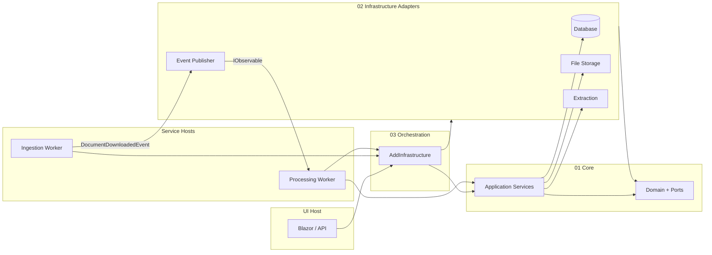

# Architectural & Solution Guidelines

> **Source:** Extracted from the ExxerCube.Prisma codebase (June 2026)  
> **Purpose:** A highly opinionated, project-agnostic guide for building enterprise .NET systems with the same architectural discipline observed in this repository.  
> **Audience:** Architects and senior engineers starting a new solution or refactoring an existing one.

---

## Table of Contents

1. [Executive Summary](#1-executive-summary)
2. [Logical Architecture](#2-logical-architecture)
3. [Physical Architecture & Deployment](#3-physical-architecture--deployment)
4. [Technology Stack](#4-technology-stack)
5. [Coding Style & Conventions](#5-coding-style--conventions)
6. [Solution Patterns & Best Practices](#6-solution-patterns--best-practices)
7. [Testing Strategy](#7-testing-strategy)
8. [Observability & Operations](#8-observability--operations)
9. [Security & Configuration](#9-security--configuration)
10. [Build, Packaging & Repository Hygiene](#10-build-packaging--repository-hygiene)
11. [Anti-Patterns to Reject](#11-anti-patterns-to-reject)
12. [Adoption Checklist for a New Project](#12-adoption-checklist-for-a-new-project)

---

## 1. Executive Summary

**Adopt Hexagonal (Ports & Adapters) Clean Architecture with a dedicated composition layer.** Do not let infrastructure projects reference each other. Do not put MediatR/CQRS in by default—use explicit application services and orchestrators instead. Treat `Result<T>` as the primary error model for business logic. Enforce architecture with automated tests, not documentation alone.

The observed system demonstrates that **architecture is code**: layering rules, interface placement, stub detection, and dependency direction are validated in CI via NetArchTest. Testing mirrors production folder structure. Workers are small, independently deployable hosts; the UI is a separate composition root.

**Core stance:** Prefer boring, explicit, testable structure over framework magic.

---

## 2. Logical Architecture

### 2.1 Layer Model

Use **numbered folders** to encode dependency direction. Numbers are not decorative—they communicate where code belongs and what it may depend on.

```
┌─────────────────────────────────────────────────────────────────────┐
│  UI Layer — Blazor Server / API / real-time clients               │
│  Composes services via DI; maps HTTP/UI errors at the boundary      │
└───────────────────────────────┬─────────────────────────────────────┘
                                │
┌───────────────────────────────▼─────────────────────────────────────┐
│  Services Layer — Deployable worker/monitor hosts                   │
│  Each host: minimal API + IHostedService + health endpoints         │
└───────────────────────────────┬─────────────────────────────────────┘
                                │
┌───────────────────────────────▼─────────────────────────────────────┐
│  Orchestration Layer — Composition root ONLY                        │
│  Single project wires all infrastructure adapters in correct order  │
└───────────────────────────────┬─────────────────────────────────────┘
                                │
        ┌───────────────────────┴───────────────────────┐
        ▼                                               ▼
┌───────────────────────┐                   ┌───────────────────────────┐
│ Application Layer     │                   │ Infrastructure Layer      │
│ Use-case services     │                   │ One project per adapter     │
│ (no ports defined)    │                   │ (DB, storage, ML, export…)  │
└───────────┬───────────┘                   └─────────────┬─────────────┘
            │                                               │
            └───────────────────┬───────────────────────────┘
                                ▼
                    ┌───────────────────────┐
                    │ Domain Layer          │
                    │ Entities, VOs, Events │
                    │ Ports (interfaces)    │
                    │ SmartEnums, Specs     │
                    └───────────────────────┘
```

### 2.2 Dependency Rules (Non-Negotiable)

| Rule | Rationale |
|------|-----------|
| **All ports (`I*`) live in Domain** | Keeps the core ignorant of technology choices |
| **Application never references Infrastructure** | Use cases depend on abstractions, not adapters |
| **Infrastructure projects never reference each other** | Prevents adapter coupling; composition happens one level up |
| **Orchestration is the only place that wires adapters** | Breaks the "no cross-infra refs" rule safely at the composition root |
| **Domain entities are persistence-agnostic** | No EF attributes, no ORM leakage into entities |
| **Every domain port has a real implementation** | Detected by architecture tests; stubs are flagged |

### 2.3 Recommended Folder Convention

```
Src/
├── 01 Core/
│   ├── Domain/          # Entities, value objects, events, ports, enums
│   └── Application/     # Application services, orchestration logic
├── 02 Infrastructure/
│   ├── Infrastructure.Database/
│   ├── Infrastructure.FileStorage/
│   ├── Infrastructure.{Capability}/   # One adapter per external concern
│   └── ...
├── 03 Orchestration/    # Composition root: AddXInfrastructure() extensions
├── 04 Services/
│   ├── {ServiceA}/      # Worker + health checks + service-specific adapters
│   └── {ServiceB}/
├── 07 UI/               # Web host
├── 08 Tests/            # Mirrors 01–07 + architecture tests
└── 09 Testing/          # Shared fixtures, containers, test abstractions
```

**Opinion:** Skip numbers 05–06 if unused, but never collapse layers into a single "Infrastructure" monolith. Split adapters by capability, not by team convenience.

### 2.4 Domain Modeling Patterns

Adopt tactical DDD where it pays off—do not cargo-cult aggregates everywhere.

| Pattern | When to use | How it was applied |
|---------|-------------|-------------------|
| **Entities & Value Objects** | Core business concepts with identity vs. equality-by-value | Separate folders; VOs immutable |
| **SmartEnums** (`EnumModel` base) | Finite state with behavior, display names, and DB persistence | Always pair with EF value converters + comparers |
| **Domain Events** | Cross-cutting reactions without tight coupling | Abstract `record` base; JSON polymorphic serialization |
| **Specification** | Composable query predicates | `ISpecification<T>` in Domain; evaluator in Infrastructure.Database |
| **Repository** | Aggregate persistence behind a port | Generic `IRepository<T>`; EF implementation isolated |
| **Strategy** | Pluggable algorithms (e.g., adaptive extraction) | Register multiple `IStrategy` implementations in DI |
| **Source Types** | Polymorphic input handling | Discriminated types per format (PDF, XML, DOCX, TXT) |

### 2.5 Application Layer: Services, Not CQRS

**Do not default to MediatR.** The observed codebase uses:

- **Application services** — one class per cohesive use case (`DocumentIngestionService`, `FieldMatchingService`)
- **Service orchestrators** — coordinate multi-stage pipelines across ports (`ProcessingOrchestrator`, `IngestionOrchestrator`)

Use CQRS only when read/write models genuinely diverge at scale. For most enterprise pipelines, explicit service classes are easier to navigate, test, and enforce architecturally.

### 2.6 Event-Driven Communication

Use **Rx.NET observables**, not classic `IEventHandler<T>` registration:

```
DomainEvent published
    → Subject<DomainEvent> (Infrastructure)
    → IObservable<TEvent> streams
    → Subscribers: orchestrators, persistence workers, UI broadcasters
```

**Rules:**
- Publish is fire-and-forget; errors are logged, never thrown upstream
- Every event carries a `CorrelationId` for tracing
- Subscribers are registered at host startup (`StartAsync` on orchestrators)
- Extract real-time UI plumbing into a dedicated package when it grows (ADR pattern: publish as NuGet, consume via abstraction)

### 2.7 Composition Root Pattern

Create a single extension method that registers all infrastructure in dependency order:

```csharp
public static IServiceCollection AddProductInfrastructure(
    this IServiceCollection services,
    string connectionString,
    Action<FileStorageOptions> configureStorage,
    IConfiguration? configuration = null)
{
    services.AddExtractionServices();
    services.AddDatabaseServices(connectionString);
    services.AddFileStorage(configureStorage);
    services.AddMetricsServices();
    // ... ordered registration
    return services;
}
```

**Opinion:** Every infrastructure project exposes its own `ServiceCollectionExtensions`. Only the Orchestration project calls them all. Host `Program.cs` files call `AddProductInfrastructure()` plus host-specific services.

---

## 3. Physical Architecture & Deployment

### 3.1 Multi-Host Topology

Deploy as **multiple small hosts**, not one monolith:

| Host type | Responsibility | Endpoints |
|-----------|----------------|-----------|
| **Web UI** | Human interaction, admin, dashboards | Blazor Server + REST + antiforgery |
| **Ingestion worker** | Poll/watch sources, emit domain events | `/health`, `/health/live`, `/health/ready`, `/dashboard` |
| **Processing worker** | Run multi-stage pipeline on events | Same health surface |
| **Monitor service** | Heartbeat, restart signaling | Library or lightweight host |

Each worker is a **minimal API + `IHostedService`**. Background work starts in `StartAsync`; HTTP surface exists only for ops.

### 3.2 Health Checks

Standardize on three endpoints per host:

- `/health` — aggregate
- `/health/live` — process is running
- `/health/ready` — dependencies reachable (DB, external APIs, Python sidecar)

Implement per-service `IHealthCheck` classes; expose a `IDashboardService` for operator visibility.

### 3.3 Polyglot Sidecars

When ML/OCR/scripting is needed:

- Keep **Python (or other runtimes) as sidecar modules**, not embedded strings
- Bridge via **CSnakes** or equivalent interop with explicit timeout/concurrency config
- Mirror test structure: `Tests.Infrastructure.Python` validates the bridge, not the ML model itself
- Document the MSBuild wiring path—duplicate trees are a known hazard; reconcile deliberately

### 3.4 Containers & Orchestration

- **Testcontainers** for integration tests (SQL Server, Ollama, etc.)—not necessarily production Dockerfiles in-repo
- Operational scripts (`scripts/docker/`) for local dev cleanup
- **Aspire is optional**—the observed pattern works without it; adopt Aspire when you need distributed dev orchestration, not before

### 3.5 Artifacts Outside the Repo

Redirect `bin/` and `obj/` to an external `BuildArtifacts/` directory via `Directory.Build.props`. Keeps git clean and avoids accidental commits of build output.

---

## 4. Technology Stack

### 4.1 Platform & Language

| Choice | Version | Stance |
|--------|---------|--------|
| **.NET** | 10 (`net10.0`) | Target latest LTS-aligned runtime centrally in `Directory.Build.props` |
| **C#** | `LangVersion=latest` | Use modern features; enforce style in build |
| **Nullable reference types** | `enable` | Combined with explicit null checks at boundaries |
| **Warnings as errors** | `true` | No warning debt accumulation |

### 4.2 Core Libraries (Recommended Defaults)

| Concern | Library | Why |
|---------|---------|-----|
| **Business errors** | `IndQuestResults` (`Result<T>`) | Railway-oriented programming; no exceptions for expected failures |
| **ORM** | EF Core 10 + SQL Server | Mature, testable with InMemory + Testcontainers |
| **DI** | Microsoft.Extensions.DependencyInjection | Native; per-adapter `ServiceCollectionExtensions` |
| **Resilience** | Polly 8 | Transient fault handling at infrastructure boundaries |
| **Events** | System.Reactive 6 | Observable streams for domain events |
| **Real-time UI** | Dedicated package (e.g., IndFusion.Ember) | Extract when SignalR/hub logic grows; don't inline |
| **Logging** | Serilog 4 + Sinks.Seq | Structured logging with `{PropertyName}` placeholders |
| **Telemetry** | OpenTelemetry 1.15+ | Traces, metrics, EF/HTTP/ASP.NET instrumentation |
| **UI** | Blazor Server + MudBlazor 8 | Component library; pin major versions until migration budget exists |
| **Auth** | ASP.NET Core Identity (cookies) + JWT abstraction ports | UI uses cookies; keep `IIdentityProvider`/`ITokenService` ports for future IdP swap |
| **Python interop** | CSnakes.Runtime | Typed bridge with MSBuild Python path targets |
| **OCR / CV** | Tesseract, Emgu.CV, ImageSharp | Capability-specific; isolate in Extraction adapter |
| **Excel / Office** | ClosedXML, DocumentFormat.OpenXml | Keep in Export/Extraction adapters only |

### 4.3 Central Package Management

**Always use** `Directory.Packages.props` with `ManagePackageVersionsCentrally=true`:

- Pin versions once; projects reference packages without version attributes
- Enable `CentralPackageTransitivePinningEnabled` to override vulnerable transitive deps
- Document suppressions (`NU1902`, etc.) with advisory links in `Directory.Build.props`

### 4.4 Testing Stack

| Tool | Role |
|------|------|
| **xUnit v3** + **Microsoft Testing Platform v2** | Test runner; filter with `--filter-query` |
| **Shouldly** | Assertions (`value.ShouldBe(expected)`) |
| **NSubstitute** | Mocking |
| **NetArchTest.Rules** | Architecture constraint tests |
| **Testcontainers** | Real SQL/Ollama in integration tests |
| **Stryker.NET** | Mutation testing on critical adapters |
| **coverlet** | Coverage collection |
| **Playwright** | Browser E2E (category-filtered) |
| **Meziantou.Extensions.Logging.Xunit.v3** | Real logging in tests |

**Banned in tests:** Moq, FluentAssertions (pick one assertion library and one mock library; enforce consistently).

---

## 5. Coding Style & Conventions

### 5.1 Naming

| Element | Convention |
|---------|------------|
| Types, properties, methods | `PascalCase` |
| Locals, parameters | `camelCase` |
| Files | Match primary type name (`FieldMatchingService.cs`) |
| Namespaces | `{Company}.{Product}.{Layer}.{Feature}` |
| Ports | `I{Capability}` in `Domain.Interfaces` |
| DI extensions | `{Layer}.DependencyInjection.ServiceCollectionExtensions` |
| Tests | `{ClassUnderTest}Tests`, `{Port}ContractTests`, `Method_Scenario_ExpectedBehavior` |

### 5.2 Async & Cancellation

Every async public method **must** accept `CancellationToken cancellationToken = default`.

```csharp
public async Task<Result<T>> ProcessAsync(Input input, CancellationToken cancellationToken = default)
{
    if (cancellationToken.IsCancellationRequested)
        return ResultExtensions.Cancelled<T>();

    // propagate cancellationToken to all downstream calls
}
```

- Use `ConfigureAwait(false)` in library and background service code
- **Never throw `OperationCanceledException`** for business flows—return `ResultExtensions.Cancelled<T>()`
- In tests: `TestContext.Current.CancellationToken` (xUnit v3), not manual `CancellationTokenSource`

### 5.3 Error Handling with Result\<T\>

```csharp
// Validation → Result failure (not throw)
if (input is null)
    return Result<T>.WithFailure("Input cannot be null");

// Success
return Result<T>.WithSuccess(value);

// Chain operations
return await LoadAsync(id, cancellationToken)
    .ThenAsync(data => TransformAsync(data, cancellationToken))
    .Map(dto => MapToOutput(dto));
```

| Layer | Pattern |
|-------|---------|
| Application / Infrastructure business logic | `Result<T>` exclusively |
| Constructor DI validation | `ArgumentNullException` for required dependencies |
| HTTP/UI boundary | Global exception middleware → structured JSON error |
| Event publishing | Swallow + log; never break the pipeline |
| Host startup DI failures | Fatal log + diagnostic file (`di_error.log`) |

### 5.4 Null Safety

- Nullable reference types enabled with warnings-as-errors
- Prefer **explicit null checks** at boundaries over relying solely on annotations
- Use `IsSuccessMayBeNull` / `IsSuccessNotNull` on `Result` values

### 5.5 SmartEnums

When replacing primitive enums:

1. Sealed class extending `EnumModel`
2. Static readonly instances with display names
3. `FromValue` / `FromName` factory methods
4. EF `HasConversion` + value comparer in entity configuration
5. Mirror in JSON serializers and cache keys when enums surface externally

### 5.6 Documentation & Style Enforcement

- `GenerateDocumentationFile=true` — XML docs on public APIs
- `EnforceCodeStyleInBuild=true` — `.editorconfig` is law
- Per-project `GlobalUsings.cs` for repetitive imports (include `IndQuestResults` in Domain)

### 5.7 Method Design

- Keep methods under ~50 lines when practical
- Favor **pure functions** and **observable streams** over event delegates
- Side effects belong in Infrastructure or host startup—not in Domain

---

## 6. Solution Patterns & Best Practices

### 6.1 Defensive Intelligence

Pipelines should be **tolerant and observable**, not brittle:

- Missing optional fields → warnings/flags, not hard stops
- Non-critical step failure → log + continue when safe
- Always measure duration with `Stopwatch`; log elapsed ms

### 6.2 Dual Database Pattern (When Identity ≠ App Data)

Separate connection strings:

- `DefaultConnection` — Identity / auth tables
- `ApplicationConnection` — domain data

Keeps auth schema migrations independent from business schema.

### 6.3 Adapter Isolation

Each external capability gets its own infrastructure project:

```
Infrastructure.Database
Infrastructure.FileStorage
Infrastructure.Extraction.Ocr
Infrastructure.Extraction.Adaptive
Infrastructure.Classification
Infrastructure.Export
Infrastructure.Metrics
Infrastructure.Events
Infrastructure.Python.{Module}
```

**Never** import one adapter from another. Shared code goes in Domain (ports/models) or a thin `CrossConcerns` library with zero adapter references.

### 6.4 Strategy Registration

For pluggable algorithms:

```csharp
services.AddScoped<IAdaptiveStrategy, RegexStrategy>();
services.AddScoped<IAdaptiveStrategy, TableStrategy>();
// ... all strategies registered; resolver picks based on input
```

Register all implementations; use a factory or composite to select at runtime.

### 6.5 ITDD — Interface-Driven Test-Driven Development

Define a port's behavioural **contract** as an `abstract` base test class, then inherit it once per
implementation (and once for a mock/blueprint instance). The mandatory shape is **ADR-005**
(`docs/architecture/adr/ADR-005-itdd-contract-tests-injected-sut.md`) — it supersedes the older
standalone `I*ContractTests.cs` shape:

```
Testing.Contracts/                  (non-runnable lib: Shouldly + xunit.v3.extensibility.core + NSubstitute)
  {Name}Contract.cs                 // abstract base — NOT discovered by xUnit
  {Name}MockFactory.cs              // reference-fake SUT (the executable design spec)
Tests.Domain.Interfaces/            (runnable)
  Mock{Name}ContractTests.cs        // blueprint instance (SUT from the mock factory)
Tests.Infrastructure.<Adapter>/     (runnable)
  {ImplName}ContractTests.cs        // one instance per implementation
```

- **N + 1 inheritors:** 1 blueprint (mock) + N real implementations, all running the identical
  `[Fact]`/`[Theory]` bodies once per deriving class (xunit.v3 + MTP discover inherited facts natively).
- **SUT mechanism:** constructor-injected interface-typed `Sut` by default; `protected abstract T
  CreateSut()` only where construction needs a per-implementation fixture (EF context, files).
- **Scope rule:** a test belongs in the base iff *any* correct implementation must pass it (Result
  semantics, null/empty handling, **cancellation**, ordering, XML-doc'd behaviour). Implementation
  richness (fixtures, regex/format specifics, confidence tiers, and **all `*MutationTests`**) stays in
  the implementation's test project — alongside, never inside, the contract.
- The mock/blueprint class is the **design spec, authored first** and **never deleted** — it becomes
  the first instance of its base; only superseded copy-paste twins are removed.

Architecture tests verify every `I*` in Domain has a non-stub implementation (IL body size), and that
every `*Contract` in `Testing.Contracts` is `abstract` with ≥ 1 inheriting test class (ADR-005 guardrail).

### 6.6 ADR Discipline

Record significant decisions in `docs/architecture/adr/ADR-NNN-{title}.md`:

- Context, decision, consequences
- Examples observed: metrics placement, adaptive extraction, real-time comm extraction to NuGet

### 6.7 Fixture-Driven Testing

Maintain a `Fixtures/` tree with real representative inputs. Tests should use production-like data, including **negative mirrors** (missing fields, blank values) to validate reconciliation behavior.

---

## 7. Testing Strategy

### 7.1 Test Pyramid

```
                    ┌─────────────┐
                    │  E2E / UI   │  Playwright, WebApplicationFactory
                    │  (few)      │
                ┌───┴─────────────┴───┐
                │  System Tests     │  Full pipeline + Testcontainers
                │  (some)           │
            ┌───┴───────────────────┴───┐
            │  Integration / Infra Tests  │  Per-adapter, real DB/container
            │  (many)                   │
        ┌───┴───────────────────────────┴───┐
        │  Unit + Contract + Architecture   │  Domain, Application, NetArchTest
        │  (most)                           │
        └───────────────────────────────────┘
```

### 7.2 Mirror Production Structure

`08 Tests/` subfolders map 1:1 to production layers:

| Test folder | Mirrors |
|-------------|---------|
| `01 Core` | Domain + Application |
| `02 Infrastructure` | Each adapter project |
| `03 Orchestration` | DI composition resolution |
| `04 Services` | Worker hosts, health checks |
| `05 System` | End-to-end pipeline scenarios |
| `06 E2E` | Full host boot + dependency validation |
| `07 UI` | Blazor services via `WebApplicationFactory` |
| `09 Architecture` | NetArchTest rules |

### 7.3 Architecture Tests (Mandatory)

Enforce in CI with NetArchTest:

1. All interfaces in `Domain.Interfaces`
2. Application declares no interfaces
3. Infrastructure does not declare domain ports
4. No cross-infrastructure dependencies
5. Domain has no EF/data annotations
6. Domain events inherit from base `DomainEvent`
7. Every domain interface has implementation
8. No duplicate type names across layers
9. Stub implementations detected and rejected

**Opinion:** If you only write one "special" test project, make it architecture tests.

### 7.4 Test Naming & Execution

```
MethodUnderTest_Scenario_ExpectedBehavior
```

```bash
# Full solution
dotnet test "Src/Product.sln"

# Single test method (xUnit v3)
dotnet test Tests.Application.csproj --filter-query "/Namespace/ClassName/MethodName"

# Category filter
dotnet test Tests.E2E.csproj --filter-query "[category=E2E]"
```

### 7.5 Mutation Testing

Configure `stryker-config.json` per critical adapter project. Set `StrykerCompat=true` env var when build output paths need flattening for Stryker binary resolution.

---

## 8. Observability & Operations

### 8.1 Structured Logging

```csharp
_logger.LogInformation("Processing {DocumentId} stage {Stage} in {ElapsedMs}ms",
    documentId, stage, stopwatch.ElapsedMilliseconds);
```

- Serilog with configuration binding
- Seq sink for centralized log search
- Correlation scopes via `LogBeginScope` dictionaries

### 8.2 OpenTelemetry

Instrument:

- ASP.NET Core requests
- HTTP client calls
- EF Core queries
- Runtime metrics
- Custom meters via `IProcessingMetricsService`

Export to Seq OTLP endpoint or your vendor of choice.

### 8.3 Dashboards per Worker

Each worker exposes `IDashboardService` for operator visibility—processing queue depth, last heartbeat, stage timings. Pair with `/health/ready` for orchestrator routing.

---

## 9. Security & Configuration

### 9.1 Secrets

- **Never** commit credentials, tokens, or connection strings
- Use environment variables, user-secrets, or Key Vault (`Azure.Identity`, `Azure.Security.KeyVault.Certificates` when on Azure)
- Document required variables in README, not in code

### 9.2 Authentication Pattern

- **Production UI:** ASP.NET Core Identity with cookies, antiforgery enabled
- **API/workers:** JWT-ready ports (`ITokenService`, `IIdentityProvider`) even if not fully wired on day one
- **Dev/test:** `InMemoryIdentityProvider` adapter—never use in production

### 9.3 Transport & Headers

- `UseHsts()` in non-development environments
- `UseAntiforgery()` on interactive UI
- Global exception handler middleware—structured JSON, no stack traces to clients in production

### 9.4 Configuration Binding

- `appsettings.json` per host with environment overlays
- `IOptions<T>` with `ValidateOnStart` for critical settings
- Python/sidecar config: modules path, concurrency limits, operation timeout

---

## 10. Build, Packaging & Repository Hygiene

### 10.1 Build Commands

```bash
dotnet restore "Src/Product.sln"
dotnet build   "Src/Product.sln"   # -warnaserror implied by TreatWarningsAsErrors
dotnet test    "Src/Product.sln"
```

### 10.2 Repository Layout

```
{RepoRoot}/
├── Src/                   # Product source (C#, Python, etc.)
├── docs/                  # Architecture, ADRs, reference manuals
├── scripts/               # Operational automation (docker, db, generators)
├── tools/                 # Standalone dev tools (simulators, utilities)
├── Fixtures/              # Test inputs
├── AGENTS.md              # Agent/human contributor guidelines
├── coverage.runsettings   # Coverlet configuration
└── run-coverage.ps1       # Coverage orchestration
```

### 10.3 Commit & PR Standards

- **Conventional Commits:** `feat:`, `fix:`, `refactor:`, `test:`, `docs:`, `chore:`
- PRs include: behavior summary, ticket link, test evidence (`dotnet test ...`), screenshots for UI
- Call out breaking changes: EF migrations, SmartEnum changes, serializer/cache impacts
- Do not add/remove solution projects without architectural review

---

## 11. Anti-Patterns to Reject

| Anti-pattern | Why it fails here |
|--------------|-------------------|
| MediatR for everything | Hides use-case entry points; harder to enforce layering |
| Throwing exceptions for validation | Bypasses `Result<T>` contract; untestable flows |
| Monolithic Infrastructure project | Cross-adapter coupling; untestable in isolation |
| EF attributes on domain entities | Breaks persistence ignorance; fails architecture tests |
| `IEventHandler<T>` with 50 registrations | Rx observables + explicit subscribers are clearer |
| Mocking `ILogger` in tests | Use real XUnit logger; logs are diagnostic assets |
| Moq + FluentAssertions | Split assertion/mock ecosystems create inconsistency |
| Secrets in appsettings committed to git | Security incident waiting to happen |
| Skipping architecture tests | Layer erosion within two sprints |
| Nullable annotations without checks | `TreatWarningsAsErrors` is not a substitute for boundary validation |

---

## 12. Adoption Checklist for a New Project

Use this when bootstrapping a greenfield solution with these guidelines:

### Week 1 — Skeleton

- [ ] Create numbered layer folders (`01 Core` through `07 UI`)
- [ ] Add `Directory.Build.props` (net10.0, nullable, warnings-as-errors, external artifacts path)
- [ ] Add `Directory.Packages.props` with central version management
- [ ] Domain project with `GlobalUsings.cs` importing `IndQuestResults`
- [ ] Application project referencing Domain only
- [ ] One Infrastructure adapter (Database) + Orchestration composition root
- [ ] `08 Tests/09 Architecture` with first NetArchTest rules
- [ ] `AGENTS.md` at repo root

### Week 2 — Patterns

- [ ] `Result<T>` on all application service public methods
- [ ] `CancellationToken` on all async methods
- [ ] Serilog + OpenTelemetry in web host
- [ ] Health endpoints on every host
- [ ] First contract test for a domain port
- [ ] Testcontainers fixture in `09 Testing`

### Ongoing

- [ ] ADR for each non-obvious technology choice
- [ ] Stryker on critical adapters
- [ ] Mirror every new production project with a test project
- [ ] Architecture test updated when adding layers or ports

---

## Appendix: Reference Diagram — Request & Event Flow



---

*This document distills observable engineering decisions from a production-grade .NET 10 system. Apply principles, adapt layer names, and replace capability-specific adapters—but do not compromise on dependency direction, `Result<T>` error models, or architecture tests.*
