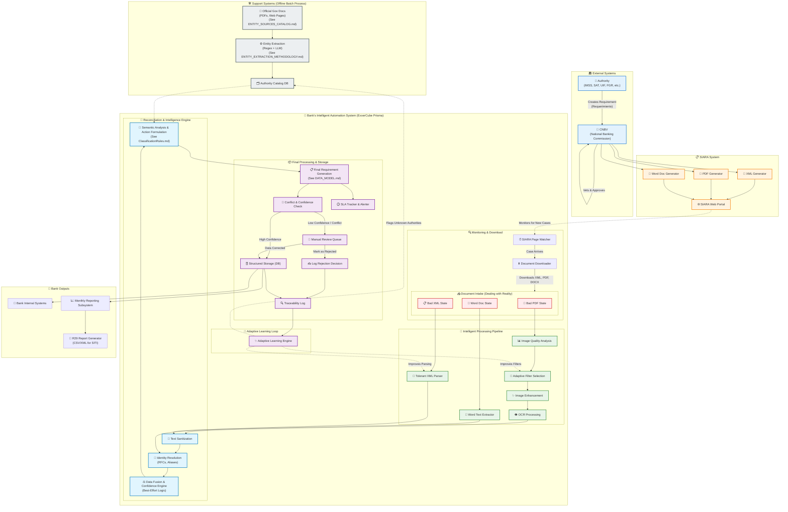

# ExxerCube Prisma - Complete System Flow (Enhanced)

## Overview
This diagram shows the complete, enhanced flow for the ExxerCube Prisma system. It includes the real-time requirement processing pipeline, the offline support systems for catalog generation, and the final reporting outputs. This design incorporates the "best-effort" principle and addresses gaps identified during analysis.

## System Flow Diagram

## Key System Characteristics (Unchanged)
...

## Technology Stack (Unchanged)
...

## Service Wiring (Unchanged)
...