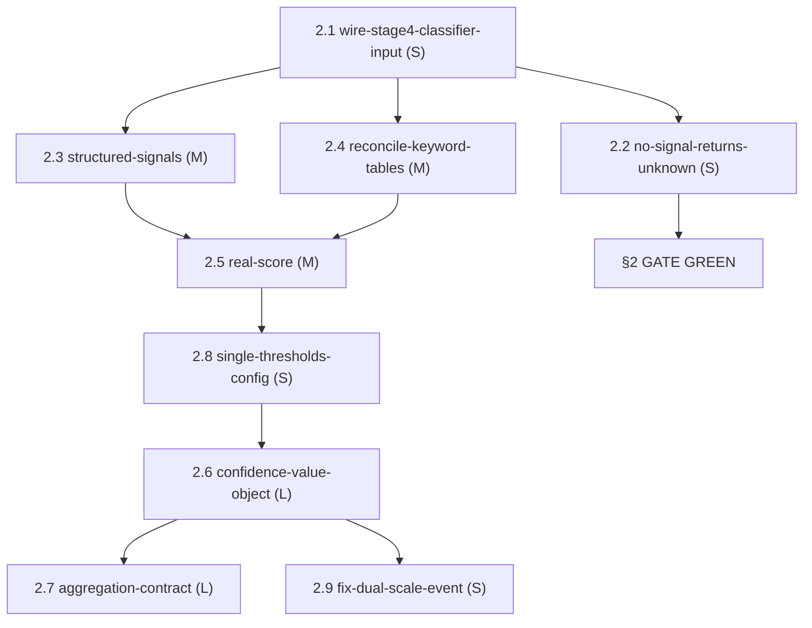

# Epic 2 — Confidence Pipeline Hardening: Sprint Plan

**Date:** 2026-06-25 · **Branch:** `Liv` · **Status:** PLAN-ONLY (hand off to orchestrator)
**Source of truth:** `docs/planning-artifacts/remediation/CONFIDENCE-PIPELINE-DEEP-INSPECTION-2026-06-25.md` (§5 tiered plan + §6 DoD).
**Context:** Blocker 3 of the §2 max-fidelity gate — `Stage 5 BLOCKED: Classification confidence 10% is below the required threshold of 70% (BlockOnLowConfidence)`. The OCR-segfault (Blocker 1) and corpus-consistency (Blocker 2) fixes have already landed (`ea90aa17` + `3c7532a2`). This epic unblocks the remaining gate hold.
**Order:** Prisma-only epic. Three independently shippable sprints; Sprint 1 alone turns the gate green.
**Effort tags:** S (≤1 day) / M (2–4 days) / L (1–2 weeks) per inspection finding.

---

## 0. How to read this plan

- **Sprints are dependency layers, not calendar dates.** All stories within a sprint may proceed in parallel unless noted; later sprints assume earlier sprint outcomes.
- **Sprint 1 is the critical path.** It contains the smallest possible change set that makes the §2 gate green. Sprints 2 and 3 raise real quality and structural soundness but do NOT block the gate.
- **Evidence bar = ground truth.** A green unit test alone is not readiness. Every story's DoD requires the named regression suite to pass plus the gate test (Sprint 1) or a classifier-behavior assertion (Sprints 2–3).
- **Story IDs are canonical** — do not renumber. They are referenced by the orchestrator handoff in §5.

---

## 1. Sprint 1 — Unblock the Gate (Tier 1, P0)

**Goal:** The §2 max-fidelity gate (`RealSiaraCase_FlowsAcrossAllThreeProcesses_WithRealPipeline_AndPersistsAudit`) reaches **green**. Stage 4 classifies the tier-1 synthetic case at ≥ 70%, the export gate passes, SIRO XML + 24-col DatosCarga XLSX emit, and audit rows persist. No-signal documents stop returning `(Aseguramiento, 10)`.

**This is the smallest change set that turns the gate green.** Stories 2.1 and 2.2 together touch three files and add two regression tests. Nothing in Tier 2 or Tier 3 is required.

**Sprint 1 stories run sequentially** (2.1 then 2.2) because 2.2 modifies `FileClassifierService.cs` which 2.1 exercises — verify 2.1 gate-green before landing 2.2.

---

### Story 2.1 — wire-stage4-classifier-input

| Field | Detail |
|-------|--------|
| **ID** | 2.1 |
| **Title** | Wire OCR/fused body text into Stage 4 classifier input |
| **Effort** | S |
| **Priority** | P0 — critical path |
| **Depends on** | None (first story to execute) |

**What and why.**
`ProcessingOrchestrator.ClassifyDocumentRopAsync:530-535` and `ReconciliationOrchestrator.cs:353-356` both construct an `ExtractedMetadata` object from only `ctx.FusionResult?.FusedExpediente`, leaving `LegalReferences` empty and the OCR body text unattached. The classifier (`FileClassifierService.cs:40-44`) scores over `(AreaDescripcion + NumeroExpediente + LegalReferences)` — for case `IMSS-2023-171230` this evaluates to `"FISCALÍA ESPECIALIZADA EN MATERIA DE DERECHOS HUMANOS EXP-8217-2021 "` which contains zero Level-1 keywords. The 1284-char OCR body contains `ASEGURAMIENTO` 4+ times; if attached, the score hits 90 and the gate passes.

**Key files to change.**

| File | Change |
|------|--------|
| `Prisma/Code/Src/CSharp/03 Orchestration/ProcessingOrchestrator/ProcessingOrchestrator.cs` | Line 530–535: populate `metadata.LegalReferences` (or a new body-text field) with the Stage-2 OCR text (`ctx.OcrResult?.ExtractedText`) and/or the fused-source concatenated text before calling `_classifier.ClassifyAsync`. |
| `Prisma/Code/Src/CSharp/04 Services/Athena/Prisma.Athena.Processing/ReconciliationOrchestrator.cs` | Line 353–356: same population pattern; note the comment at `:96` admitting the OCR result is "currently unused by Stage 4" — remove that comment when fixed. |

**Regression tests that must stay green.**

| Suite | Key lines / scenario |
|-------|----------------------|
| `ReconciliationOrchestratorExportGateTests.cs` | Lines 149 / 201 / 251 / 314 / 361 / 403 — confidence comparisons against the 70-threshold must continue to behave as designed. |
| `ProcessingOrchestratorTests.cs` | Line 541 — flag-for-review at confidence 45 vs threshold 70. |

**New test to add.**
Assert that a document whose OCR body contains `ASEGURAMIENTO` classifies as `Aseguramiento` with confidence ≥ 70. Use `IMSS-2023-171230` fixture data or an inline stub that reproduces the body text shape.

**Definition of Done.**

- `ProcessingOrchestrator.cs` and `ReconciliationOrchestrator.cs` both pass the Stage-2 OCR text into `ExtractedMetadata` before `ClassifyAsync`.
- The stale "currently unused" comment at `ReconciliationOrchestrator.cs:96` is removed.
- New regression test: `ClassifyDocument_WithAaseguramientoBodyText_ReturnsConfidenceAbove70`.
- All named regression suites green.
- Build 0/0, warnings-as-errors.
- §2 gate run (`RealSiaraCase_...` filter): Stage 4 logs `Type: Aseguramiento, Confidence: 90` (or ≥ 70), Stage 5 does not fire `BlockOnLowConfidence`.

---

### Story 2.2 — no-signal-returns-unknown

| Field | Detail |
|-------|--------|
| **ID** | 2.2 |
| **Title** | No-signal classification returns Unknown, not (Aseguramiento, 10) |
| **Effort** | S |
| **Priority** | P0 — correctness hazard, pair with 2.1 |
| **Depends on** | 2.1 verified green (same file region; avoid concurrent edit) |

**What and why.**
`DetermineLevel1Category` (`FileClassifierService.cs:238-251`) does `OrderByDescending(value).First()` over a dictionary. When all six categories score the no-match floor of 10, the first inserted key (`Aseguramiento`) wins by dictionary-insertion-order tie-break. `CalculateConfidence` (`FileClassifierService.cs:205-236`) propagates `10` as the confidence. The result `(Aseguramiento, 10)` *looks* like a real classification at a real-looking confidence — it is a correctness hazard for any document whose body text fails to reach the classifier (e.g., empty OCR, wrong language, unrecognised format). After story 2.1 lands, real documents will score correctly; this story ensures the degenerate no-signal case is explicitly labelled rather than silently mislabelled.

**Key files to change.**

| File | Change |
|------|--------|
| `Prisma/Code/Src/CSharp/02 Infrastructure/Infrastructure.Classification/FileClassifierService.cs` | `DetermineLevel1Category` (`:238-251`): when all category scores equal the floor value (all tied), return a sentinel value such as `DocumentType.Unknown` (or `Unclassified`) instead of taking the first dictionary entry. `CalculateConfidence` (`:205-236`): when `maxScore` equals the no-match floor and all scores are tied, return `0` (or an explicit `NoSignal` confidence) — never return `10` as if it were a meaningful probability. |

**Regression tests that must stay green.**
Same as story 2.1: `ReconciliationOrchestratorExportGateTests.cs` and `ProcessingOrchestratorTests.cs:541`. The gate test at score 50 / 95 / 30 / 90 uses documents that DO have signal — those must continue to route correctly.

**New tests to add.**
- `Classify_WithEmptyBodyText_ReturnsUnknownType` — assert that an `ExtractedMetadata` with empty `LegalReferences`, empty `AreaDescripcion`, empty `NumeroExpediente` produces `DocumentType.Unknown` (or equivalent) and confidence 0 (not 10).
- `Classify_WithNoKeywordMatches_NeverReturnsAseguramientoByDefault` — assert that a document containing only noise text (no legal keywords) does not label as `Aseguramiento`.

**Definition of Done.**

- `FileClassifierService.DetermineLevel1Category` returns an explicit `Unknown`/`Unclassified` sentinel on all-tied floor scores.
- `FileClassifierService.CalculateConfidence` returns 0 (not 10) on a no-signal all-tie.
- Both new tests green.
- All named regression suites green.
- Build 0/0.
- No document in the §2 gate is labelled `(Aseguramiento, 10)` after the pipeline run.

---

### Sprint 1 — Exit Criterion

> **§2 gate green.** The test `MaxFidelityGateFullPipelineE2ETests / RealSiaraCase_FlowsAcrossAllThreeProcesses_WithRealPipeline_AndPersistsAudit` passes end-to-end: Stage 4 classifies the Aseguramiento case at ≥ 70%, Stage 5 emits SIRO XML + 24-col XLSX, audit rows ≥ 2 processes persist. No-signal documents return `Unknown`, not `(Aseguramiento, 10)`. Build 0/0.

---

## 2. Sprint 2 — Classifier Hardening (Tier 2, P1)

**Goal:** The classifier consults richer signals (boolean `TieneAseguramiento`, reconciled keyword tables) and its confidence score is semantically meaningful (not a keyword-bucket spread). PLD and other types are verified against the actual generator prose. Tests pin the new behaviour.

Sprint 2 depends on Sprint 1 (body text must be wired before structured-signal routing is useful). Stories 2.3, 2.4, and 2.5 are logically ordered 2.3 → 2.4 → 2.5 but 2.4 is mostly a research/edit task that can proceed in parallel with 2.3 if disjoint team capacity allows.

---

### Story 2.3 — structured-signals

| Field | Detail |
|-------|--------|
| **ID** | 2.3 |
| **Title** | Route Stage 4 through structured boolean signals from the fused Expediente |
| **Effort** | M |
| **Priority** | P1 |
| **Depends on** | 2.1 (body text must reach classifier before structured signal routing pays off) |

**What and why.**
`Expediente.TieneAseguramiento == true` is extracted by the XML companion and fused; `ExpedienteClasifierService.cs:379` already returns 0.90 for it — but `ExpedienteClasifierService` is **not** the wired Stage-4 classifier (`FileClassifierService` is, per `Reconciliator Program.cs:151`, `Athena Program.cs:163`). The structured boolean is richer and more reliable than substring matching. The team must decide: (a) route Stage 4 through `ExpedienteClasifierService` / `ClassificationDictionary` (richer, handles the boolean) or (b) fold the boolean signal into `FileClassifierService` as a high-weight shortcut. Either approach closes the gap; document the chosen path in an inline comment or ADR note.

**Key files to touch.**

| File | Why |
|------|-----|
| `Infrastructure.Classification/FileClassifierService.cs` | Add boolean-signal fast path (option b) or remove it from Stage-4 DI (option a). |
| `Infrastructure.Classification/ExpedienteClasifierService.cs:379` | Reference point for the already-correct boolean → 0.90 logic. |
| `Reconciliator Program.cs:151` / `Athena Program.cs:163` | DI wiring change if option (a) is chosen. |

**Regression tests that must stay green.**
`ReconciliationOrchestratorExportGateTests.cs`, `ProcessingOrchestratorTests.cs:541`.

**New tests to add.**
- `Classify_WithTieneAseguramientoTrue_ReturnsAseguramientoAbove80` — pass a fused `Expediente` with `TieneAseguramiento = true`; assert classification type and confidence ≥ 80.
- Corresponding negative: `Classify_WithTieneAseguramientoFalse_DoesNotReturnAseguramientoOnNameAlone`.

**Definition of Done.**

- Stage 4 consults `Expediente.TieneAseguramiento` (and equivalent booleans for other document types present in the fused model) before or in addition to substring keyword matching.
- The chosen routing strategy is documented with a comment in the classifier or in an ADR note.
- New structured-signal tests green.
- All regression suites green. Build 0/0.

---

### Story 2.4 — reconcile-keyword-tables

| Field | Detail |
|-------|--------|
| **ID** | 2.4 |
| **Title** | Reconcile classifier keyword sets against generator prose |
| **Effort** | M |
| **Priority** | P1 |
| **Depends on** | 2.1 (meaningful only once body text is fed to the classifier) |

**What and why.**
`FileClassifierService.cs:159-172` defines PLD keywords as `LAVADO`, `OPERACIONES ILICITAS`; the generator (`legal_catalog.py`) emits *"recursos de procedencia ilícita"* and *"operaciones inusuales"* — a genuine miss. Similar mismatches may exist for other document types. The keyword sets must be reconciled against the actual prose templates across all document types in `legal_catalog.py` so the classifier can score them correctly.

**Key files to touch.**

| File | Why |
|------|-----|
| `Infrastructure.Classification/FileClassifierService.cs:85–175` | Update keyword lists for each document type based on the reconciliation output. |
| `Prisma/Code/Src/Python/prisma-ai-extractors/` or the active generator under `Prisma/PRP/PRP1/research/generators/` | Read-only reference — do not modify the generator. |

**Regression tests that must stay green.**
All existing classifier tests; `ReconciliationOrchestratorExportGateTests.cs`.

**New tests to add.**
For each document type where a keyword gap is found: one test asserting a document whose body contains only the generator-emitted prose (not the old hard-coded keyword) is correctly classified at ≥ 70.

**Definition of Done.**

- A written reconciliation table (inline comment block or committed markdown note) lists, per document type, the generator prose phrases that were added to the keyword set.
- PLD classification correctly handles *"recursos de procedencia ilícita"* and *"operaciones inusuales"*.
- Per-type keyword-gap tests green.
- All regression suites green. Build 0/0.

---

### Story 2.5 — real-score

| Field | Detail |
|-------|--------|
| **ID** | 2.5 |
| **Title** | Replace keyword-bucket confidence heuristic with a semantically grounded score |
| **Effort** | M |
| **Priority** | P1 |
| **Depends on** | 2.3, 2.4 (keyword tables and signal routing must be stable before redesigning the scoring function) |

**What and why.**
`FileClassifierService.CalculateConfidence:205-236` computes `int 0–100` from `maxScore` / `averageScore` / `scoreDifference` — three keyword-bucket aggregates. The resulting number is not a calibrated likelihood; it is a spread metric that collapses to the floor value (10) on any no-signal input (fixed by story 2.2). At minimum the band semantics must be documented so downstream consumers understand what the number means; ideally the score is derived from match strength and keyword coverage so it is monotonically meaningful.

**Key files to touch.**

| File | Why |
|------|-----|
| `Infrastructure.Classification/FileClassifierService.cs:205-236` | Redesign or document the confidence function. |

**Regression tests that must stay green.**
`ReconciliationOrchestratorExportGateTests.cs` (lines 149 / 201 / 251 / 314 / 361 / 403 — these use hard-coded confidence values 50 / 95 / 30 / 90; the redesign must keep those scenarios routing to the same gate outcomes, updating the expected confidence values if the new function produces different numbers for the same inputs).

**New tests to add.**
- `Confidence_ScalesMonotonicallyWithMatchStrength` — three documents (strong match, weak match, no match) score in strictly descending order.
- `Confidence_IsZeroForNoSignalDocument` — paired with story 2.2 assertion.

**Definition of Done.**

- `CalculateConfidence` carries an XML doc comment explaining the semantics of the returned value (what does 90 mean vs 70 vs 40?).
- The function is monotonically meaningful: a document with more/stronger keyword hits scores higher than one with fewer/weaker hits.
- Existing gate-scenario tests updated if expected confidence values change.
- New monotonicity + zero-signal tests green. Build 0/0.

---

### Sprint 2 — Exit Criterion

> Classifier consults `TieneAseguramiento` (and equivalent booleans); keyword sets cover the actual generator prose; confidence score is monotonically meaningful and documented. Tests pin all new behaviours. All §4.4 regression suites green. Build 0/0.

---

## 3. Sprint 3 — Confidence Model Re-architecture (Tier 3, P1/P2)

**Goal:** A single `Confidence` abstraction replaces the four-scale problem; thresholds live in one bound config object; the dual-scale event is fixed. An ADR records the aggregation contract. The §4.4 regression tests are migrated.

**Execution order within Sprint 3:** 2.8 first (lowest blast radius — pure config binding, no domain change), then 2.6 (the VO — depends on a clean single-threshold baseline), then 2.7 (aggregation contract — needs the VO), then 2.9 (dual-scale event fix — consumes the VO). Stories 2.6 and 2.8 are independent and may proceed in parallel if capacity allows, but 2.7 and 2.9 must follow 2.6.

Sprint 3 depends on Sprint 2 being complete (the confidence function should be stable before introducing a shared VO that wraps it).

---

### Story 2.8 — single-thresholds-config

| Field | Detail |
|-------|--------|
| **ID** | 2.8 |
| **Title** | Bind ExportGatePolicy and consolidate all confidence thresholds into one config object |
| **Effort** | S |
| **Priority** | P1 (lowest risk in Sprint 3; do first — unblocks 2.6 by stabilising the numeric baseline) |
| **Depends on** | Sprint 2 complete |

**What and why.**
`ExportGatePolicy` (`ExportGatePolicy.cs:28`) has `SectionName = "ExportGatePolicy"` and settable bools but is **never bound** — no `Configure<ExportGatePolicy>` / `GetSection` / `.Bind` anywhere, no key in any appsettings. The classification confidence threshold `70` is **hardcoded** at `ReconciliationOrchestrator.cs:42` and **duplicated** at `ProcessingOrchestrator.cs:56`. A stray `< 80` lives in `ManualReviewerService.cs:646-660`. Fusion uses `0.70` and `0.85` in `FusionCoefficients.cs:136,129`. These must all be consolidated into one bound configuration source with a single numeric convention (either all `0–1` or all `0–100`; recommend `0–1` to match the future VO scale).

**Key files to change.**

| File | Change |
|------|--------|
| `Infrastructure/ExportGatePolicy.cs` | Add `ClassificationConfidenceThreshold double` (default `0.70`) and `ManualReviewThreshold double` (default `0.80`). Wire `Configure<ExportGatePolicy>` in both composition roots (`Reconciliator Program.cs:157`, `ProcessingOrchestrator.cs:116`). Add `"ExportGatePolicy"` section to `appsettings.json` of both workers. |
| `ReconciliationOrchestrator.cs:42` | Remove hardcoded `70`; inject `ExportGatePolicy` and read `.ClassificationConfidenceThreshold` (convert to `int 0–100` for the current `int`-typed comparison — or normalise the comparison; note: story 2.6 will ultimately remove this conversion). |
| `ProcessingOrchestrator.cs:56` | Same — remove the duplicated `70` constant. |
| `ManualReviewerService.cs:646-660` | Replace `< 80` with `_policy.ManualReviewThreshold`; inject `ExportGatePolicy`. |
| `FusionCoefficients.cs:136,129` | These fusion-specific values (`0.70` / `0.85`) are on the `0–1` scale and concern fusion reliability, not export-gate confidence — leave them in `FusionCoefficients` but add a comment cross-referencing `ExportGatePolicy` to prevent silent divergence. |

**Regression tests that must stay green.**
`ReconciliationOrchestratorExportGateTests.cs` (all gate scenario lines), `ProcessingOrchestratorTests.cs:541`, `FusionExpedienteServiceMutationTests.cs:236-281`, `ReconciliationPipelineServiceTests.cs:199,204`.

**New tests to add.**
- Integration test: inject a non-default `ExportGatePolicy` (e.g. threshold `0.50`) and assert that a document with classification confidence `0.60` passes the gate.
- Unit test: assert that the default-constructed policy has `ClassificationConfidenceThreshold = 0.70` and `ManualReviewThreshold = 0.80`.

**Definition of Done.**

- `ExportGatePolicy` is bound at both composition roots; its `appsettings.json` section is present with sensible defaults.
- The hardcoded `70` constants in `ReconciliationOrchestrator.cs:42` and `ProcessingOrchestrator.cs:56` are gone.
- `ManualReviewerService.cs:646` uses the injected policy threshold.
- All regression suites green. Build 0/0.

---

### Story 2.6 — confidence-value-object

| Field | Detail |
|-------|--------|
| **ID** | 2.6 |
| **Title** | Introduce a shared Confidence value object on a fixed 0–1 scale with provenance |
| **Effort** | L |
| **Priority** | P1 |
| **Depends on** | 2.8 (thresholds consolidated; numeric baseline stable) |

**What and why.**
Four stages emit four confidence representations on four different scales (`enum` quality, `float 0–100` OCR, `double 0–1` fusion, `int 0–100` classification). There is no shared `Confidence` abstraction in the pipeline domain (the `ConfidenceGuard` in `Veriqan.Domain/Verification/ConfidenceGuard.cs:32` is in the separate Veriqan bounded context and is unreferenced here). Without a shared VO: the `0.70`-vs-`70` collision is structurally unfixable, scale-bridging code is scattered, and combining confidences is impossible.

**Key files to change.**

| File | Change |
|------|--------|
| New file: `Domain/ValueObjects/Confidence.cs` | `readonly record struct Confidence(double Value, ConfidenceSource Source)` with `Value` clamped `[0, 1]`, implicit operators from `float`/`int` with scale annotation, `Combine(IEnumerable<Confidence> sources, ...)` and `Min`/`WeightedAverage` factory methods. Include `ConfidenceSource` enum (`Quality`, `Ocr`, `Fusion`, `Classification`). |
| `OCRResult.cs:16` | Change `float ConfidenceAvg` → `Confidence Confidence` (the 0–100 float is scaled to 0–1 at construction). |
| `FusionResult.cs:28` | Change `double OverallConfidence` → `Confidence Confidence`. |
| `ClassificationResult.cs:28` | Change `int Confidence` → `Confidence Confidence` (the gate comparison in `ReconciliationOrchestrator.cs` uses the VO's `.Value` vs `_policy.ClassificationConfidenceThreshold` — same numeric convention now). |
| `ImageQualityAssessment` | Add `Confidence Confidence` field (replaces the hardcoded `0.9f` constant in `PolynomialImageQualityAnalyzer.cs:129`; see note below). |
| `ExtractionOrchestrator.cs:377` | Remove the ad-hoc `/ 100.0` bridge; OCR now delivers a VO already on 0–1. |
| Comparison in `ReconciliationOrchestrator.cs` and `ProcessingOrchestrator.cs` | Update to compare `classificationResult.Confidence.Value >= _policy.ClassificationConfidenceThreshold`. |

**Note on `PolynomialImageQualityAnalyzer.cs:129`:** the hardcoded `0.9f` with a "trained model" comment over stub coefficients is a known stub. The VO migration sets `Confidence.FromQuality(0.9, ConfidenceSource.Quality)` as a transitional value; story 2.7 addresses whether quality confidence enters the export gate.

**Regression tests that must stay green.**
All of §4.4: `ReconciliationOrchestratorExportGateTests.cs`, `ProcessingOrchestratorTests.cs:541`, `FusionExpedienteServiceMutationTests.cs:236-281`, `ReconciliationPipelineServiceTests.cs:199,204`. Update numeric comparisons in these tests to use the VO `.Value` convention (e.g. `0.90` not `90`).

**New tests to add.**
- `Confidence_ClampsBelowZeroToZero` and `Confidence_ClampsAboveOneToOne`.
- `Confidence_FromIntScale_ConvertsCorrectly` — `Confidence.FromInt(70, ConfidenceSource.Classification).Value == 0.70`.
- `Confidence_WeightedAverage_ProducesExpectedResult`.

**Definition of Done.**

- `Confidence` VO exists in the Domain layer; all four pipeline result types carry it.
- The ad-hoc `/ 100.0` bridge at `ExtractionOrchestrator.cs:377` is removed.
- The gate comparison in `ReconciliationOrchestrator` and `ProcessingOrchestrator` uses `.Value` vs `_policy.ClassificationConfidenceThreshold` (both on 0–1).
- All §4.4 regression suites updated and green.
- New VO unit tests green. Build 0/0.

---

### Story 2.7 — aggregation-contract

| Field | Detail |
|-------|--------|
| **ID** | 2.7 |
| **Title** | Define and document an explicit document-confidence aggregation contract |
| **Effort** | L |
| **Priority** | P2 (architectural — does not block the gate or Sprint 2 goals) |
| **Depends on** | 2.6 (VO must exist before aggregation can be expressed) |

**What and why.**
The export gate (`ReconciliationOrchestrator.EvaluateExportGate:214-258`) evaluates three independent sub-gates; OCR confidence (95.71%), fusion confidence (0.83), and quality (`Q3_Low`) are never compared to a threshold — only the classification `int` drives the gate. The gate's decision is therefore: *only the weakest, most brittle signal decides auto-export*. Whether that is the right policy is a deliberate owner decision; what is wrong is that the policy is implicit and undocumented.

**Key files to change.**

| File | Change |
|------|--------|
| Existing ADR (authored under this epic): `docs/architecture/adr/ADR-023-Unified-Confidence-Model.md` — finalize/ratify its aggregation-contract section | Record: (1) the definition of "document confidence" (what it represents); (2) which signals compose the export-gate decision (classification-only vs. weighted-pipeline-average); (3) whether OCR/fusion/quality enter the gate; (4) whether the quality signal should flow (requires populating `QualityIndex` in `ExtractionOrchestrator.cs:403-408` — currently only `MeanConfidence` is set). |
| `ExtractionOrchestrator.cs:403-408` | Either formally populate `ExtractionMetadata.QualityIndex` from the Stage-1 result (if ADR decides quality enters the gate) or add an explicit comment declaring quality advisory-only. |
| `ReconciliationOrchestrator.EvaluateExportGate:214-258` | If the ADR decides additional signals enter the gate, add the corresponding sub-gate here; otherwise add a comment block referencing ADR-023 and documenting why OCR/fusion confidence are advisory. |

**Regression tests that must stay green.**
All §4.4 suites.

**New tests to add.**
Tests implementing whatever the ADR decides — if OCR confidence enters the gate, add a scenario where OCR < threshold blocks even at high classification confidence, and vice versa.

**Definition of Done.**

- ADR-023 exists and is committed; it records the owner-approved aggregation policy.
- `ExtractionOrchestrator.cs:403` either populates `QualityIndex` or carries a comment declaring quality advisory per ADR-023.
- If the ADR adds signals to the gate, the corresponding sub-gate logic and tests are present.
- All §4.4 regression suites green. Build 0/0.

---

### Story 2.9 — fix-dual-scale-event

| Field | Detail |
|-------|--------|
| **ID** | 2.9 |
| **Title** | Fix ClassificationCompletedEvent to carry a single Confidence, not dual-scale fields |
| **Effort** | S |
| **Priority** | P1 (small; do last in Sprint 3 once the VO is stable) |
| **Depends on** | 2.6 (the VO must exist so the event can carry it) |

**What and why.**
`Domain/Events/ClassificationCompletedEvent.cs:24-26, 51-53` carries both `Confidence` (`int 0–100`) and `ConfidenceScore` (`double 0–1`) — two fields for the same concept on two different scales. Any consumer that reads one and ignores the other may observe a different value. This is the most concrete manifestation of the four-scale problem at the domain event boundary.

**Key files to change.**

| File | Change |
|------|--------|
| `Domain/Events/ClassificationCompletedEvent.cs` | Replace `int Confidence` and `double ConfidenceScore` with a single `Confidence Confidence` (the VO from story 2.6). Update the constructor and all producers. |
| All consumers of `ClassificationCompletedEvent` | Search for references to `.Confidence` and `.ConfidenceScore` and migrate to `.Confidence.Value`. |

**Regression tests that must stay green.**
Any test that constructs or reads `ClassificationCompletedEvent` (grep the test projects for this type name); all §4.4 suites.

**New tests to add.**
- `ClassificationCompletedEvent_CarriesSingleConfidenceField` — assert the event has exactly one confidence-carrying property.
- `ClassificationCompletedEvent_RoundTrips_ThroughJson` — serialize and deserialize; confirm `.Confidence.Value` survives.

**Definition of Done.**

- `ClassificationCompletedEvent` has one `Confidence Confidence` field; the `int Confidence` and `double ConfidenceScore` fields are gone.
- All consumers updated; no `CS0618` warnings.
- New event-shape tests green. All §4.4 regression suites green. Build 0/0.

---

### Sprint 3 — Exit Criterion

> A single `Confidence` VO on 0–1 replaces the four-scale problem; `ExportGatePolicy` is bound at both composition roots and drives all thresholds; ADR-023 records the aggregation contract; `ClassificationCompletedEvent` carries a single confidence field. The §4.4 regression test suite is migrated to VO semantics and fully green. Build 0/0.

---

## 4. Dependency Graph

```
Sprint 1 (P0 — gate critical path)
────────────────────────────────────────────────────
  [none] ──► 2.1 wire-stage4-classifier-input  (S)
              │
              ▼
             2.2 no-signal-returns-unknown      (S)
              │
              └──────────── §2 GATE GREEN ◄────┘


Sprint 2 (P1 — classifier hardening; starts after Sprint 1 complete)
────────────────────────────────────────────────────
  2.1 ──► 2.3 structured-signals              (M)
  2.1 ──► 2.4 reconcile-keyword-tables        (M)  [can parallel 2.3]
  2.3, 2.4 ──► 2.5 real-score                (M)


Sprint 3 (P1/P2 — re-architecture; starts after Sprint 2 complete)
────────────────────────────────────────────────────
  [Sprint 2] ──► 2.8 single-thresholds-config (S)  [first — lowest risk]
                  │
                  ▼
                 2.6 confidence-value-object   (L)
                  │              │
                  ▼              ▼
                 2.7 aggregation-contract (L)  2.9 fix-dual-scale-event (S)
```

**Mermaid alternative (for tooling that renders it):**



---

## 5. Regression Test Safety Net (§4.4 Summary)

These tests must stay green across all three sprints. Any story that changes confidence values, thresholds, or classification routing must run and verify these before committing.

| Suite | What it guards | Stories that touch it |
|-------|---------------|----------------------|
| `ReconciliationOrchestratorExportGateTests.cs` lines 149/201/251/314/361/403 | All three export-gate sub-gates at confidences 50/95/30/90 | 2.1, 2.2, 2.5, 2.6, 2.8 |
| `ProcessingOrchestratorTests.cs:541` | Flag-for-review at confidence 45 vs threshold 70 | 2.1, 2.6, 2.8 |
| `FusionExpedienteServiceMutationTests.cs:236-281` | Fusion `NextAction` at 0.85 / 0.70 | 2.6, 2.8 |
| `ReconciliationPipelineServiceTests.cs:199,204` | Reason-string assertions for gate outcomes | 2.2, 2.5, 2.6 |

---

## 6. Effort Rollup

| Sprint | Stories | Sizes | Notes |
|--------|---------|-------|-------|
| Sprint 1 | 2.1, 2.2 | S + S | Hours-level; gate unblocked in one session |
| Sprint 2 | 2.3, 2.4, 2.5 | M + M + M | 2.3 and 2.4 may parallel; 2.5 serial last |
| Sprint 3 | 2.8, 2.6, 2.7, 2.9 | S + L + L + S | 2.8 first; 2.6 and 2.8 may parallel if capacity allows |
| **Total** | 9 stories | 4×S + 4×M + 2×L | ~3–5 sprints single dev; parallelises well with orchestrator+subagent model |

---

## 7. Delegate to bmad-orchestrator — Handoff

This section is addressed to the implementation orchestrator that will execute the plan.

### What to pick up and in what order

**Pick up Sprint 1 first and only Sprint 1.** Stories 2.1 and 2.2 are the entire critical path. Do not start Sprint 2 until the §2 gate run is confirmed green from ground truth (not from unit tests alone).

### Sprint 1 execution sequence

1. Read the inspection source at `docs/planning-artifacts/remediation/CONFIDENCE-PIPELINE-DEEP-INSPECTION-2026-06-25.md` §2 (root cause) and §5 (Tier 1 fix) before starting any code change.
2. Execute story 2.1 (`wire-stage4-classifier-input`): change `ProcessingOrchestrator.cs:530` and `ReconciliationOrchestrator.cs:353-356`. Add the new regression test. Run `ReconciliationOrchestratorExportGateTests` and `ProcessingOrchestratorTests` — both must be green.
3. Verify the §2 gate from ground truth: run `dotnet test <Tests.AllRealWireE2E.csproj> --filter-query "/*/*/MaxFidelityGateFullPipelineE2ETests/RealSiaraCase_FlowsAcrossAllThreeProcesses_WithRealPipeline_AndPersistsAudit"` (with the SIARA simulator running and `TESSDATA_PREFIX` set per the box-setup recipe in `EXECUTION-TRACKER.md` §Handoff). Confirm Stage 4 logs confidence ≥ 70 and Stage 5 does not block.
4. Only if the gate is green: execute story 2.2 (`no-signal-returns-unknown`). Run the same regression suites plus the two new no-signal tests. Re-run the gate to confirm it is still green.
5. Commit Sprint 1 as a single logical batch, adversarially review (use `plan-completion-reviewer` agent), remediate any Majors, then push.

### Gate verification command (box-specific)

```bash
TESSDATA_PREFIX=/usr/share/tesseract-ocr/5/tessdata \
dotnet test \
  "Prisma/Code/Src/CSharp/08 Tests/09 E2E AllRealWire/Tests.AllRealWireE2E/ExxerCube.Prisma.Tests.AllRealWireE2E.csproj" \
  --filter-query "/*/*/MaxFidelityGateFullPipelineE2ETests/RealSiaraCase_FlowsAcrossAllThreeProcesses_WithRealPipeline_AndPersistsAudit"
```

Prerequisites (from `EXECUTION-TRACKER.md` §2026-06-25 handoff): SIARA simulator running on `http://localhost:5002` (`Kestrel__Endpoints__Https__Url=http://localhost:5002`), OCR-segfault resolved, consistent 3-companion corpus case present.

### Proceeding to Sprint 2

Only proceed to Sprint 2 after the gate is confirmed green from the test run above. Announce the gate-green result in the tracker before starting any Sprint-2 story. Then execute 2.3 and 2.4 in parallel (different file trees), wait for both, then 2.5.

### Proceeding to Sprint 3

Only proceed to Sprint 3 after Sprint 2 classifier hardening tests are green and the gate re-run at the end of Sprint 2 confirms no regression. Execute Sprint 3 in the order 2.8 → 2.6 → (2.7 ∥ 2.9).

### What NOT to do

- Do not start Sprint 2 before confirming the gate is green from a real test run.
- Do not attempt to parallelize stories within Sprint 1 — they touch overlapping code and the gate must be verified between them.
- Do not change the generator (`legal_catalog.py`) or the synthetic corpus fixtures as part of this epic — story 2.4 is a read-only reference pass against the generator; all changes are to the classifier.
- Do not delete the dormant Python/CSnakes VLM scaffolding — per ADR-001 and CLAUDE.md it is intentional optionality-by-design.
- Do not modify `ExportGatePolicy.cs` toggles to work around a failing gate — the fix is the wiring change in 2.1, not toggling off the gate.

### Tracker update instructions

After each story lands, update `docs/planning-artifacts/remediation/EXECUTION-TRACKER.md` §Handoff with the commit hash, which story closed, and the current gate status. The pattern is established in the tracker's existing session entries.

---

*Plan complete. Plan-only — no production code modified. Canonical source: `CONFIDENCE-PIPELINE-DEEP-INSPECTION-2026-06-25.md`. Owner approval gate next; then hand to bmad-orchestrator starting with Sprint 1.*
