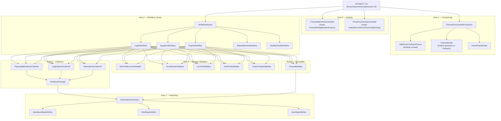

# ExxerCube.Prisma QA Harness — Architecture

**Document status:** Design-only. No production code written yet.
**Author:** Winston (Architect persona) — 2026-06-20
**Revision:** 1.0

---

## 1. Purpose and Scope

The QA Harness (`ExxerCube.Prisma.QaHarness`) is a **first-class compiled C# library** that
encapsulates every product-specific artefact required to drive automated testing of the Prisma
MVP without requiring the caller to understand the internals of the product.

Critical constraint: **the harness makes no PASS/FAIL judgements.** It provisions, executes,
collects evidence, and reports raw findings. A separate, independent QA agent consumes the
harness and renders verdicts.

The harness covers seven responsibility areas (§3 maps each to components):

| # | Area | Short label |
|---|------|-------------|
| 1 | Environment Provisioning | Provision |
| 2 | Application Startup | Hosting |
| 3 | Workflow Library | Workflows |
| 4 | Domain Validators | Validators |
| 5 | Evidence Collection | Evidence |
| 6 | Traceability Support | Trace |
| 7 | Reporting Support | Report |

---

## 2. Project Layout

All projects sit under `Prisma/Code/Src/CSharp/09 Testing/02 QaHarness/`.

```
09 Testing/
  02 QaHarness/
    ExxerCube.Prisma.QaHarness/                  ← Core library (the harness itself)
    ExxerCube.Prisma.QaHarness.Cli/              ← Thin CLI front-end (shell-invocable runner)
    ExxerCube.Prisma.QaHarness.Tests/            ← Self-test project (xUnit v3, mtp-v2)
```

### 2.1 Assembly names and root namespaces

| Project | Assembly | Root namespace |
|---------|----------|----------------|
| `ExxerCube.Prisma.QaHarness` | `ExxerCube.Prisma.QaHarness` | `ExxerCube.Prisma.QaHarness` |
| `ExxerCube.Prisma.QaHarness.Cli` | `ExxerCube.Prisma.QaHarness.Cli` | `ExxerCube.Prisma.QaHarness.Cli` |
| `ExxerCube.Prisma.QaHarness.Tests` | `ExxerCube.Prisma.QaHarness.Tests` | `ExxerCube.Prisma.QaHarness.Tests` |

### 2.2 Internal folder structure of the core library

```
ExxerCube.Prisma.QaHarness/
  Provisioning/
    IEnvironmentProvisioner.cs
    EnvironmentProvisioningResult.cs
    PrismaEnvironmentProvisioner.cs        ← real implementation
    CorpusSeeder.cs                         ← delegates to Python generator + Fixtures/
    DockerHealthGate.cs                     ← verifies Docker is live before tests
  Hosting/
    IApplicationHostController.cs
    ApplicationStartupResult.cs
    PrismaWebUiHostController.cs            ← wraps PrismaWebApplicationFactory
    ThreeProcessHostController.cs           ← wraps GateOrion/Athena/Reconciliator
  Workflows/
    IWorkflow.cs
    IWorkflowRunner.cs
    WorkflowContext.cs
    WorkflowResult.cs
    Catalog/
      LoginWorkflow.cs                      ← browser login to Web UI
      IngestionWorkflow.cs                  ← SIARA case discovery + ingest
      ExportWorkflow.cs                     ← trigger export, await ExportCompletedEvent
      ManualReviewWorkflow.cs               ← navigate review queue, record disposition
      HealthCheckWorkflow.cs                ← hit /health/live + /health/ready
      ConfigWorkflow.cs                     ← appsettings read/write via UI
  Validators/
    IDomainValidator.cs                     ← IDomainValidator<TSubject>
    ValidationResult.cs
    SiroXml/
      SiroXmlStructureValidator.cs
      SiroXmlSchemaValidator.cs
    Export/
      ExcelExportValidator.cs               ← 24-column Datos-Carga-Oficio check
    Ocr/
      OcrTextValidator.cs                   ← OCR output vs ground truth
    Pipeline/
      AuditTrailValidator.cs                ← audit rows present + ProcessId non-null
      FusionOutputValidator.cs              ← .fusion.json present, fields populated
    Health/
      HealthEndpointValidator.cs
  Evidence/
    IEvidenceCollector.cs
    EvidencePackage.cs
    EvidenceItem.cs
    EvidenceKind.cs                         ← enum: Screenshot, Log, File, NetworkTrace, Diagnostic
    PlaywrightEvidenceCollector.cs          ← screenshots + videos via Playwright IPage
    LogEvidenceCollector.cs                 ← captures Serilog sink output
    FileEvidenceCollector.cs                ← harvests shared-storage artefacts
  Traceability/
    ITraceabilityMap.cs
    TraceabilityEntry.cs
    RequirementRef.cs                       ← PRD requirement identifier
    FeatureRef.cs
    InvariantRef.cs
    TraceabilityMap.cs                      ← in-memory map, serializable to JSON
  Reporting/
    IReportWriter.cs
    HarnessRunSummary.cs
    MarkdownReportWriter.cs
    HtmlReportWriter.cs
    JsonReportWriter.cs
  DependencyInjection/
    QaHarnessServiceCollectionExtensions.cs ← AddQaHarness() convenience extension
  GlobalUsings.cs
  ExxerCube.Prisma.QaHarness.csproj
```

---

## 3. Component Map — Seven Responsibility Areas

### 3.1 Area 1 — Environment Provisioning

**Existing assets reused:**
- `SqlServerContainerFixture.cs` (+ `CreateIsolatedDatabaseAsync`) — container lifecycle.
- `OllamaContainerFixture.cs` — AI model container (when needed).
- `ContainerFixtureBase.cs` — shared container patterns.
- `docker-compose.dev.yml` — 6-service full stack reference.
- Python generator `Prisma-dumy-generator-AAA/` — document corpus generation.
- `Prisma/Code/Fixtures/` — static PRP1 Degraded fixtures Q1–Q4.

**New components:**
- `IEnvironmentProvisioner` — single orchestrating interface.
- `PrismaEnvironmentProvisioner` — calls `SqlServerContainerFixture`, runs EF migrations, calls `CorpusSeeder`.
- `CorpusSeeder` — shells out to the Python generator (`generate_corpus.py`) when the SIARA corpus dir is absent; falls back to static Fixtures; records seeding status in `EnvironmentProvisioningResult.CorpusStatus`.
- `DockerHealthGate` — checks Docker daemon liveness before any container work; emits a `CapabilityUnavailable` entry in the result when Docker is absent (graceful degradation, not a throw).

**Key design decision:** corpus absence is not a fatal error. `EnvironmentProvisioningResult` carries a `CorpusStatus` field with values `Seeded`, `RestoredFromFixtures`, `AbsentNoGenerator`, `AbsentGeneratorFailed`. The caller (QA agent) decides how to interpret absence.

### 3.2 Area 2 — Application Startup

**Existing assets reused:**
- `PrismaWebApplicationFactory` — dual-host (TestServer + Kestrel) already correct.
- `TestWebApplicationFactory` (Tests.EndToEnd) — same pattern for E2E.
- `GateOrionApp`, `GateAthenaApp`, `GateReconciliatorApp` (AllRealWireE2E) — three-process wiring.
- `MaxFidelityGateE2EBase.BuildThreeHostsWithDb()` — the env-var-scoped host boot trick.
- `IsSimulatorRunningAsync()` + `StartSimulatorAsync()` — SIARA simulator lifecycle.

**New components:**
- `IApplicationHostController` — start/stop/health-verify abstraction.
- `ApplicationStartupResult` — contains `IsHealthy`, `BaseAddress`, `StartupDurationMs`, `FailureReason`.
- `PrismaWebUiHostController` — wraps `PrismaWebApplicationFactory`; exposes `HttpClient` and Kestrel base address.
- `ThreeProcessHostController` — wraps the Gate host trio; exposes `OrionApp`, `AthenaApp`, `ReconciliatorApp`; delegates to `BuildThreeHostsWithDb`; handles the `ConnectionStrings__DefaultConnection` env-var scoping.

**What the QA CLI uses:** it calls `IApplicationHostController.StartAsync()` and uses `ApplicationStartupResult` to verify startup before running any workflow.

### 3.3 Area 3 — Workflow Library

**Existing assets reused:**
- `PlaywrightBrowserAutomationAdapter` — browser session, login, navigation, storage-state capture.
- `LoginAndCaptureStorageStateAsync()` from `MaxFidelityGateE2EBase` — the proven retry pattern.
- `DiscoverFullCompanionCaseAsync()` — SIARA discovery loop.
- `IngestionOrchestrator.IngestCaseAsync()` — real ingestion path.
- `SiaraWatchLoop.RunAsync` — autonomous poll loop.

**New components:**
- `IWorkflow` — marker interface with `Name`, `Description`, `Tags`, `RequiredCapabilities`.
- `IWorkflowRunner` — `RunAsync(IWorkflow, WorkflowContext, CancellationToken)` returning `WorkflowResult`.
- `WorkflowContext` — carries `IServiceProvider`, `IEvidenceCollector`, `ITraceabilityMap`, `IPage?` (Playwright page).
- `WorkflowResult` — `WorkflowName`, `StartedAt`, `FinishedAt`, `Status` (Completed/Aborted/Skipped), `EvidencePackage`.
- Six catalog workflows (see folder listing above). Each workflow is a concrete class implementing `IWorkflow`; the runner calls `workflow.ExecuteAsync(context, ct)`.

**Extension model:** a QA agent adds a new workflow by implementing `IWorkflow`, registering it with `AddQaHarness().AddWorkflow<TWorkflow>()`, and it becomes automatically available to the CLI and to `IWorkflowRunner`.

### 3.4 Area 4 — Domain Validators

**Existing assets consolidated:**
- SIRO XML schema validation logic from `SiroXmlExporterTests.cs` (the schema-parse + `XNamespace` assertions).
- Excel 24-column header check from `MaxFidelityGateFullPipelineE2ETests` (ClosedXML worksheet header loop).
- OCR ground truth patterns from `Tests.Infrastructure.Extraction.Teseract`.
- Audit trail assertions from `MaxFidelityGateE2EBase.PollAuditRowsAsync()`.
- Health endpoint checks from `Tests.Athena.HealthChecks`.

**New components:**
- `IDomainValidator<TSubject>` — `ValidateAsync(TSubject subject, CancellationToken ct)` returning `ValidationResult`.
- `ValidationResult` — `IsConformant`, `Findings` list (each finding: `RuleId`, `Description`, `Observed`, `Expected`).
- Concrete validators per area above. Note: validators report findings but never assign PASS/FAIL — the QA agent reads `IsConformant` and `Findings` to make that call.

**Extension model:** implement `IDomainValidator<T>`, register with `AddQaHarness().AddValidator<T, TValidator>()`.

### 3.5 Area 5 — Evidence Collection

**Existing assets reused:**
- `TestLoggerFactory` + `XUnitLogger` — structured log capture.
- Playwright `IPage` — screenshots, video, network tracing via existing adapter.
- `FileEvidenceCollector` — walks `_sharedStorageDir` collecting `.siro.xml`, `.fusion.json`, `.datos-carga-oficio.xlsx`.

**New components:**
- `IEvidenceCollector` — `CaptureScreenshotAsync()`, `CaptureLogSnapshotAsync()`, `HarvestFilesAsync()`, `CaptureNetworkTraceAsync()`.
- `EvidencePackage` — collection of `EvidenceItem` records (Kind, Path, Label, Timestamp, SizeBytes).
- `EvidenceKind` — `Screenshot | LogSnapshot | GeneratedFile | NetworkHar | Diagnostic | Video`.
- `PlaywrightEvidenceCollector` — delegates to `IPage.ScreenshotAsync()` and Playwright tracing API.
- `LogEvidenceCollector` — attaches a custom Serilog `ISink` during the run, dumps to file on flush.

**Corpus of evidence items accumulates in `EvidencePackage` and is embedded in `WorkflowResult`.**

### 3.6 Area 6 — Traceability Support

**New components (no existing equivalent to reuse):**
- `RequirementRef` — `(string Id, string Title, string Section)` — maps to PRD section identifiers.
- `FeatureRef` — `(string Id, string Name)`.
- `InvariantRef` — `(string Id, string Description)`.
- `TraceabilityEntry` — links a `WorkflowResult` or `ValidationResult` to one or more `RequirementRef | FeatureRef | InvariantRef`.
- `ITraceabilityMap` — `AddEntry(TraceabilityEntry)`, `GetEntriesFor(string refId)`, `GetAllEntries()`, `SerializeToJsonAsync(string path, CancellationToken ct)`.
- `TraceabilityMap` — in-memory implementation. Thread-safe (ConcurrentBag internally).

**Each workflow is pre-wired with traceability entries** (the `IWorkflow` implementation annotates itself with `[TracesRequirement("REQ-xxx")]` attributes); the runner auto-populates the map after each workflow run.

### 3.7 Area 7 — Reporting Support

**Existing pattern reused:**
- `CalibrationReportRenderer` (Veriqan harness) — the Markdown table pattern, repo-root locator, and `RenderAndWriteAsync` pattern are the direct model for this.

**New components:**
- `HarnessRunSummary` — top-level DTO: `RunId`, `StartedAt`, `FinishedAt`, `WorkflowResults`, `ValidationResults`, `EvidencePackage`, `TraceabilityMap`.
- `IReportWriter` — `WriteAsync(HarnessRunSummary summary, string outputPath, CancellationToken ct)`.
- `MarkdownReportWriter` — produces a structured Markdown document (per Phase 2 report template: executive summary, requirement table, feature table, invariant table, findings, human-review queue, coverage, risk, deployment recommendation scaffold).
- `HtmlReportWriter` — wraps the Markdown output via a minimal template (no external dependency; simple `StringBuilder` with inline CSS).
- `JsonReportWriter` — `System.Text.Json` serialization of `HarnessRunSummary` for machine consumption.

---

## 4. Public API Surface Sketch

All async methods follow repo conventions: `CancellationToken cancellationToken = default`, return `Result<T>`, never throw for business logic, check cancellation at entry.

### 4.1 Environment Provisioning

```csharp
namespace ExxerCube.Prisma.QaHarness.Provisioning;

public interface IEnvironmentProvisioner
{
    /// <summary>Builds and verifies all required infrastructure.</summary>
    Task<Result<EnvironmentProvisioningResult>> ProvisionAsync(
        ProvisioningOptions options,
        CancellationToken cancellationToken = default);

    /// <summary>Tears down infrastructure created during <see cref="ProvisionAsync"/>.</summary>
    Task<Result> TeardownAsync(
        EnvironmentProvisioningResult provisioningResult,
        CancellationToken cancellationToken = default);
}

public sealed record ProvisioningOptions(
    bool StartSqlContainer = true,
    bool StartOllamaContainer = false,
    bool SeedCorpus = true,
    string? CorpusOutputPath = null,
    int CorpusDocumentCount = 10);

public sealed record EnvironmentProvisioningResult(
    string? SqlConnectionString,
    string? OllamaEndpoint,
    string CorpusPath,
    CorpusStatus CorpusStatus,
    bool DockerAvailable,
    IReadOnlyList<CapabilityStatus> CapabilityStatuses);

public enum CorpusStatus { Seeded, RestoredFromFixtures, AbsentNoGenerator, AbsentGeneratorFailed }
```

### 4.2 Application Hosting

```csharp
namespace ExxerCube.Prisma.QaHarness.Hosting;

public interface IApplicationHostController : IAsyncDisposable
{
    Task<Result<ApplicationStartupResult>> StartAsync(
        HostingOptions options,
        CancellationToken cancellationToken = default);

    Task<Result> StopAsync(CancellationToken cancellationToken = default);

    IServiceProvider? Services { get; }
    Uri? BaseAddress { get; }
}

public sealed record HostingOptions(
    HostingMode Mode,
    string? SqlConnectionString = null,
    string? SharedStoragePath = null,
    string? SiaraStorageState = null,
    bool DisableAutonomousWatchLoop = true);

public enum HostingMode { WebUiOnly, ThreeProcessPipeline, All }

public sealed record ApplicationStartupResult(
    bool IsHealthy,
    Uri? BaseAddress,
    long StartupDurationMs,
    string? FailureReason);
```

### 4.3 Workflow Library

```csharp
namespace ExxerCube.Prisma.QaHarness.Workflows;

public interface IWorkflow
{
    string Name { get; }
    string Description { get; }
    IReadOnlyList<string> Tags { get; }
    IReadOnlyList<string> RequiredCapabilities { get; }  // e.g. "Docker", "Playwright", "SiaraSimulator"

    Task<WorkflowResult> ExecuteAsync(
        WorkflowContext context,
        CancellationToken cancellationToken = default);
}

public interface IWorkflowRunner
{
    Task<WorkflowResult> RunAsync(
        IWorkflow workflow,
        WorkflowContext context,
        CancellationToken cancellationToken = default);

    IReadOnlyList<IWorkflow> AvailableWorkflows { get; }
}

public sealed record WorkflowContext(
    IServiceProvider Services,
    IEvidenceCollector Evidence,
    ITraceabilityMap Traceability,
    Microsoft.Playwright.IPage? PlaywrightPage = null,
    string? SharedStoragePath = null);

public sealed record WorkflowResult(
    string WorkflowName,
    DateTimeOffset StartedAt,
    DateTimeOffset FinishedAt,
    WorkflowStatus Status,
    string? AbortReason,
    EvidencePackage Evidence,
    IReadOnlyDictionary<string, object?> Outputs);

public enum WorkflowStatus { Completed, Aborted, Skipped }
```

### 4.4 Domain Validators

```csharp
namespace ExxerCube.Prisma.QaHarness.Validators;

public interface IDomainValidator<TSubject>
{
    string ValidatorId { get; }
    string Description { get; }

    Task<ValidationResult> ValidateAsync(
        TSubject subject,
        CancellationToken cancellationToken = default);
}

public sealed record ValidationResult(
    string ValidatorId,
    bool IsConformant,
    IReadOnlyList<ValidationFinding> Findings);

public sealed record ValidationFinding(
    string RuleId,
    FindingSeverity Severity,
    string Description,
    string? Observed,
    string? Expected);

public enum FindingSeverity { Critical, Major, Minor, Info }
```

### 4.5 Evidence Collection

```csharp
namespace ExxerCube.Prisma.QaHarness.Evidence;

public interface IEvidenceCollector
{
    Task<Result<EvidenceItem>> CaptureScreenshotAsync(
        string label,
        CancellationToken cancellationToken = default);

    Task<Result<EvidenceItem>> CaptureLogSnapshotAsync(
        string label,
        CancellationToken cancellationToken = default);

    Task<Result<IReadOnlyList<EvidenceItem>>> HarvestFilesAsync(
        string sourcePath,
        string pattern,
        string label,
        CancellationToken cancellationToken = default);

    Task<Result<EvidenceItem>> CaptureNetworkTraceAsync(
        string label,
        CancellationToken cancellationToken = default);

    EvidencePackage CurrentPackage { get; }
    void Reset();
}

public sealed record EvidencePackage(
    string RunId,
    IReadOnlyList<EvidenceItem> Items);

public sealed record EvidenceItem(
    EvidenceKind Kind,
    string Label,
    string AbsolutePath,
    DateTimeOffset CapturedAt,
    long SizeBytes);

public enum EvidenceKind { Screenshot, LogSnapshot, GeneratedFile, NetworkHar, Diagnostic, Video }
```

### 4.6 Traceability

```csharp
namespace ExxerCube.Prisma.QaHarness.Traceability;

public interface ITraceabilityMap
{
    void AddEntry(TraceabilityEntry entry);
    IReadOnlyList<TraceabilityEntry> GetEntriesFor(string refId);
    IReadOnlyList<TraceabilityEntry> GetAllEntries();

    Task<Result> SerializeToJsonAsync(
        string outputPath,
        CancellationToken cancellationToken = default);
}

public sealed record TraceabilityEntry(
    string SourceId,            // WorkflowName or ValidatorId
    TraceabilitySourceKind SourceKind,
    IReadOnlyList<RequirementRef> Requirements,
    IReadOnlyList<FeatureRef> Features,
    IReadOnlyList<InvariantRef> Invariants,
    DateTimeOffset RecordedAt);

public enum TraceabilitySourceKind { Workflow, Validator, Manual }

public sealed record RequirementRef(string Id, string Title, string? Section = null);
public sealed record FeatureRef(string Id, string Name);
public sealed record InvariantRef(string Id, string Description);
```

### 4.7 Reporting

```csharp
namespace ExxerCube.Prisma.QaHarness.Reporting;

public interface IReportWriter
{
    string Format { get; }  // "markdown" | "html" | "json"

    Task<Result<string>> WriteAsync(
        HarnessRunSummary summary,
        string outputPath,
        CancellationToken cancellationToken = default);
}

public sealed record HarnessRunSummary(
    string RunId,
    string ProductVersion,
    DateTimeOffset StartedAt,
    DateTimeOffset FinishedAt,
    EnvironmentProvisioningResult ProvisioningResult,
    IReadOnlyList<WorkflowResult> WorkflowResults,
    IReadOnlyList<ValidationResult> ValidationResults,
    EvidencePackage Evidence,
    ITraceabilityMap TraceabilityMap);
```

---

## 5. Extension Model

### Adding a new Workflow

1. Create a class implementing `IWorkflow` in any assembly that references the harness library.
2. Annotate with `[TracesRequirement("REQ-xxx")]`, `[TracesFeature("F-xxx")]`, `[TracesInvariant("INV-xxx")]` (custom attributes supplied by the harness).
3. Register: `services.AddQaHarness().AddWorkflow<MyWorkflow>();`
4. The `IWorkflowRunner` implementation discovers all registered `IWorkflow` instances; the CLI adds them to its command list automatically.

### Adding a new Validator

1. Implement `IDomainValidator<TSubject>`.
2. Register: `services.AddQaHarness().AddValidator<TSubject, MyValidator>();`
3. Call via `IWorkflowRunner`-emitted `WorkflowContext.Services.GetServices<IDomainValidator<TSubject>>()`.

### Adding a new Report format

Implement `IReportWriter` and register with `AddQaHarness().AddReportWriter<MyReportWriter>()`.

---

## 6. Execution Model

```
QA Agent / CLI
     │
     ▼
IEnvironmentProvisioner.ProvisionAsync()
     │  (Docker + SQL + corpus)
     ▼
IApplicationHostController.StartAsync()
     │  (Web UI / 3-process pipeline)
     ▼
IWorkflowRunner.RunAsync(workflow, context)  [one per workflow]
     │  ├─ workflow.ExecuteAsync()
     │  │    ├─ IEvidenceCollector.Capture*()
     │  │    ├─ IDomainValidator<T>.ValidateAsync()
     │  │    └─ ITraceabilityMap.AddEntry()
     │  └─ returns WorkflowResult
     ▼
IReportWriter.WriteAsync(HarnessRunSummary)
     │  (Markdown, HTML, JSON)
     ▼
IApplicationHostController.StopAsync()
     ▼
IEnvironmentProvisioner.TeardownAsync()
```

---

## 7. Data Flow Diagram



---

## 8. CLI Front-End Design

`ExxerCube.Prisma.QaHarness.Cli` is a .NET console app (`OutputType=Exe`) that:

- Accepts `--workflow <name>`, `--all-workflows`, `--provision-only`, `--report-format <md|html|json>`, `--output-dir <path>`.
- Loads `QaHarnessServiceCollectionExtensions.AddQaHarness()` via `Microsoft.Extensions.Hosting`.
- Calls `IEnvironmentProvisioner`, `IApplicationHostController`, `IWorkflowRunner`, `IReportWriter` in sequence.
- Emits JSON to stdout for machine consumers; Markdown report to `--output-dir`.
- Returns exit code 0 on successful run (not on QA outcome — the caller reads the report for verdicts).
- Gracefully reports `CapabilityUnavailable` items (missing Docker, missing corpus) without aborting unless a required capability is missing for the requested workflow.

---

## 9. Self-Test Project (`ExxerCube.Prisma.QaHarness.Tests`)

The self-test project proves the harness components are wired correctly. It does NOT perform QA of the product — it tests the harness itself.

**Test categories:**

| Category tag | What it covers | Docker required |
|---|---|---|
| `[fast]` | Unit: validator logic on fixture files, report writer output, traceability map | No |
| `[integration]` | IEnvironmentProvisioner + DockerHealthGate; CorpusSeeder against static Fixtures | Yes |
| `[e2e-harness]` | Full harness run: provision → start Web UI → HealthCheckWorkflow → shutdown → report | Yes + Playwright |

**Definition of done for the self-test project:** `dotnet test` on the `ExxerCube.Prisma.QaHarness.Tests.csproj` runs the `[fast]` suite green (0/0 build, all passing) without Docker. The `[integration]` and `[e2e-harness]` suites run only in CI or on demand.

---

## 10. Phased Implementation Breakdown

Each chunk = one subagent task. Chunks are ordered; parallel markers indicate which can be submitted concurrently.

### Legend

- **S** = sequential (depends on prior chunk)
- **P** = parallel (disjoint file set, no conflicts)
- **DoD** = definition of done

---

### Chunk 0 — Solution Scaffolding (SEQUENTIAL, prerequisite for all others)

**Files created:**
- `09 Testing/02 QaHarness/ExxerCube.Prisma.QaHarness/ExxerCube.Prisma.QaHarness.csproj`
- `09 Testing/02 QaHarness/ExxerCube.Prisma.QaHarness.Cli/ExxerCube.Prisma.QaHarness.Cli.csproj`
- `09 Testing/02 QaHarness/ExxerCube.Prisma.QaHarness.Tests/ExxerCube.Prisma.QaHarness.Tests.csproj`
- All three projects added to `ExxerCube.Prisma.sln`.
- `GlobalUsings.cs` and empty `DependencyInjection/QaHarnessServiceCollectionExtensions.cs` stubs in the library.

**Dependencies on prior chunks:** none.

**Conflict points:** only the `.sln` file (single edit to add three projects).

**DoD:** `dotnet build` on the three new `.csproj` files succeeds individually with 0 errors, 0 warnings. The `.sln` lists all three projects.

---

### Chunk 1 — Core Abstractions (SEQUENTIAL after Chunk 0; PARALLEL-safe within)

**Files created (library only):**
- `Provisioning/IEnvironmentProvisioner.cs`, `EnvironmentProvisioningResult.cs`, `ProvisioningOptions.cs`
- `Hosting/IApplicationHostController.cs`, `ApplicationStartupResult.cs`, `HostingOptions.cs`
- `Workflows/IWorkflow.cs`, `IWorkflowRunner.cs`, `WorkflowContext.cs`, `WorkflowResult.cs`
- `Validators/IDomainValidator.cs`, `ValidationResult.cs`, `ValidationFinding.cs`
- `Evidence/IEvidenceCollector.cs`, `EvidencePackage.cs`, `EvidenceItem.cs`, `EvidenceKind.cs`
- `Traceability/ITraceabilityMap.cs`, `TraceabilityEntry.cs`, `RequirementRef.cs`, `FeatureRef.cs`, `InvariantRef.cs`
- `Reporting/IReportWriter.cs`, `HarnessRunSummary.cs`
- `Workflows/Attributes/TracesRequirementAttribute.cs`, `TracesFeatureAttribute.cs`, `TracesInvariantAttribute.cs`

**Dependencies:** Chunk 0.

**Conflict points:** none (all new files).

**DoD:** `dotnet build ExxerCube.Prisma.QaHarness.csproj` 0/0. No implementations yet — only interfaces and records.

---

### Chunk 2A — Provisioning Implementation (PARALLEL with 2B, 2C, 2D)

**Files created:**
- `Provisioning/PrismaEnvironmentProvisioner.cs`
- `Provisioning/CorpusSeeder.cs`
- `Provisioning/DockerHealthGate.cs`
- `DependencyInjection/QaHarnessServiceCollectionExtensions.cs` (first partial — registers IEnvironmentProvisioner)

**Dependencies:** Chunk 1.

**Conflict points:** `QaHarnessServiceCollectionExtensions.cs` — coordinate with 2B/2C/2D; use partial classes or merge at integration time. Recommended: each chunk adds a separate `Register*` static method; the extension class stitches them together in Chunk 3.

**DoD:** `dotnet build ExxerCube.Prisma.QaHarness.csproj` 0/0. Unit test in `QaHarness.Tests`: `CorpusSeeder_WhenStaticFixturesExist_ReturnsRestoredFromFixtures` passes (no Docker needed).

---

### Chunk 2B — Hosting Implementation (PARALLEL with 2A, 2C, 2D)

**Files created:**
- `Hosting/PrismaWebUiHostController.cs`
- `Hosting/ThreeProcessHostController.cs`

**No files modified** (both wrap existing infrastructure via `ProjectReference`; the harness `.csproj` adds `<ProjectReference>` to `ExxerCube.Prisma.Web.UI.csproj`, `Prisma.Orion.Worker.csproj`, `Prisma.Athena.Worker.csproj`, `Prisma.Reconciliator.Worker.csproj`).

**Dependencies:** Chunk 1.

**Conflict points:** none (new files only; `.csproj` additions are isolated to the QaHarness project file).

**DoD:** `dotnet build ExxerCube.Prisma.QaHarness.csproj` 0/0. Unit test: `PrismaWebUiHostController_StartAsync_ReturnsHealthy` (integration tag, Docker + WAF). Fast-only DoD: `ApplicationStartupResult` records compile and round-trip through JSON.

---

### Chunk 2C — Evidence + Traceability Implementation (PARALLEL with 2A, 2B, 2D)

**Files created:**
- `Evidence/PlaywrightEvidenceCollector.cs`
- `Evidence/LogEvidenceCollector.cs`
- `Evidence/FileEvidenceCollector.cs`
- `Traceability/TraceabilityMap.cs`

**Dependencies:** Chunk 1.

**Conflict points:** none.

**DoD:** `dotnet build ExxerCube.Prisma.QaHarness.csproj` 0/0. Unit tests (fast): `TraceabilityMap_AddEntry_CanBeRetrievedByRefId`, `FileEvidenceCollector_HarvestFiles_FindsSiroXmlFiles`.

---

### Chunk 2D — Reporting Implementation (PARALLEL with 2A, 2B, 2C)

**Files created:**
- `Reporting/MarkdownReportWriter.cs`
- `Reporting/HtmlReportWriter.cs`
- `Reporting/JsonReportWriter.cs`

**Pattern:** directly follows `CalibrationReportRenderer` approach (StringBuilder Markdown, repo-root locator, never throw for write failure).

**Dependencies:** Chunk 1.

**Conflict points:** none.

**DoD:** `dotnet build ExxerCube.Prisma.QaHarness.csproj` 0/0. Unit tests (fast): `MarkdownReportWriter_Write_ProducesRequiredSections`, `JsonReportWriter_Write_IsValidJson`.

---

### Chunk 3 — Domain Validators (SEQUENTIAL after Chunks 2A–2D; PARALLEL among validator sub-chunks)

Sub-chunks 3A–3D can run in parallel (disjoint validator files).

**3A — SIRO XML Validators:**
- `Validators/SiroXml/SiroXmlStructureValidator.cs`
- `Validators/SiroXml/SiroXmlSchemaValidator.cs`

**3B — Export Validators:**
- `Validators/Export/ExcelExportValidator.cs` (24-column header check, ClosedXML)

**3C — OCR + Pipeline Validators:**
- `Validators/Ocr/OcrTextValidator.cs`
- `Validators/Pipeline/AuditTrailValidator.cs`
- `Validators/Pipeline/FusionOutputValidator.cs`

**3D — Health Validators:**
- `Validators/Health/HealthEndpointValidator.cs`

**Dependencies per sub-chunk:** Chunk 1 (for `IDomainValidator<T>`).

**Conflict points:** none (all validators are separate files in separate sub-folders).

**DoD:** each sub-chunk — `dotnet build ExxerCube.Prisma.QaHarness.csproj` 0/0 + at least one fast unit test per validator exercised on a real fixture file (e.g. `Prisma/Code/Fixtures/PRP1_Degraded_Q1/`).

---

### Chunk 4 — Workflow Catalog (SEQUENTIAL after Chunk 3; PARALLEL among workflow sub-chunks)

Sub-chunks 4A–4C can run in parallel.

**4A — Browser Workflows:**
- `Workflows/Catalog/LoginWorkflow.cs` (wraps `PlaywrightBrowserAutomationAdapter`)
- `Workflows/Catalog/ManualReviewWorkflow.cs`

**4B — Pipeline Workflows:**
- `Workflows/Catalog/IngestionWorkflow.cs` (wraps `IngestionOrchestrator.IngestCaseAsync`)
- `Workflows/Catalog/ExportWorkflow.cs` (subscribes to `ExportCompletedEvent`)

**4C — Operational Workflows:**
- `Workflows/Catalog/HealthCheckWorkflow.cs`
- `Workflows/Catalog/ConfigWorkflow.cs`

**WorkflowRunner implementation:**
- `Workflows/DefaultWorkflowRunner.cs` — resolves `IWorkflow` instances from DI, checks `RequiredCapabilities`, invokes `workflow.ExecuteAsync`, appends traceability entries.

**Dependencies:** Chunk 3 (validators used inside workflows).

**Conflict points:** `DefaultWorkflowRunner.cs` is shared; only one sub-chunk should own it (assign to 4A).

**DoD:** `dotnet build ExxerCube.Prisma.QaHarness.csproj` 0/0. Fast unit tests: `HealthCheckWorkflow_Execute_AbortedWhenCapabilityUnavailable`. Integration test: `IngestionWorkflow_Execute_CompletedWithSiroXmlEvidence` (Docker + SiaraSimulator tag).

---

### Chunk 5 — DI Wiring + CLI (SEQUENTIAL after Chunk 4)

**Files created/modified:**
- `DependencyInjection/QaHarnessServiceCollectionExtensions.cs` — final unified registration (merges all partial registrations from 2A–2D, 3, 4).
- `ExxerCube.Prisma.QaHarness.Cli/Program.cs` — console host, argument parsing, orchestration loop.
- `ExxerCube.Prisma.QaHarness.Cli/ExxerCube.Prisma.QaHarness.Cli.csproj` — references the library.

**Dependencies:** Chunks 0–4.

**Conflict points:** `QaHarnessServiceCollectionExtensions.cs` was touched in multiple prior chunks; consolidate here.

**DoD:** `dotnet run --project ExxerCube.Prisma.QaHarness.Cli -- --provision-only` exits 0 and emits a JSON summary. CLI `--help` lists available workflows.

---

### Chunk 6 — Self-Test Suite Completion (SEQUENTIAL after Chunk 5)

**Files created:**
- `ExxerCube.Prisma.QaHarness.Tests/` — fast unit tests for all areas (validators, report writers, traceability map, workflow status, corpus seeder).
- `ExxerCube.Prisma.QaHarness.Tests/HarnessIntegrationTests.cs` — integration-tagged full harness smoke test.

**Dependencies:** Chunk 5.

**Conflict points:** none (test project only).

**DoD:** `dotnet test ExxerCube.Prisma.QaHarness.Tests.csproj --filter-query "[category=fast]"` — 0 build errors, all fast tests green.

---

### Chunk Execution Map

```
Chunk 0 (scaffold)
   │
Chunk 1 (abstractions)
   │
   ├─── Chunk 2A (provisioning)   ─┐
   ├─── Chunk 2B (hosting)         ├── ALL PARALLEL
   ├─── Chunk 2C (evidence+trace)  │
   └─── Chunk 2D (reporting)      ─┘
                    │
            Chunk 3 (validators)
            3A, 3B, 3C, 3D PARALLEL
                    │
            Chunk 4 (workflows)
            4A, 4B, 4C PARALLEL
                    │
            Chunk 5 (DI + CLI)
                    │
            Chunk 6 (self-test)
```

---

## 11. Risks and Constraints

### R1 — Docker / Testcontainers gate

Several capabilities require Docker 29.5+. The harness handles this via `DockerHealthGate` and `CapabilityUnavailable` status rather than throwing. Workflows declare `RequiredCapabilities`; the runner skips and records `WorkflowStatus.Skipped` when the capability is absent.

**Mitigation:** every workflow has a fast/no-Docker path for the self-test suite (`[category=fast]` runs without Docker).

### R2 — SIARA corpus absent

`Prisma/Deployments/Siara.Simulator/bulk_generated_documents_all_formats/` is gitignored generated data that was lost after the Docker reboot. The `IngestionWorkflow` and `MaxFidelity` workflows will produce `WorkflowStatus.Aborted` with `AbortReason = "CorpusAbsent"`.

**Mitigation:** `CorpusSeeder` calls `generate_corpus.py` if Python is available; otherwise falls back to static `Prisma/Code/Fixtures/`. The harness documents this as a known limitation in `EnvironmentProvisioningResult.CorpusStatus`.

### R3 — Playwright / Chromium install

`playwright install chromium` must have run on the machine. The harness checks for the Playwright browser binary at startup. `LoginWorkflow` and `ManualReviewWorkflow` declare `RequiredCapabilities = ["Playwright"]`.

**Mitigation:** `DockerHealthGate` pattern extended to a `PlaywrightCapabilityGate`.

### R4 — MTP version coupling (xUnit v3)

The self-test project must reference `xunit.v3.mtp-v2` `3.2.2` and `Microsoft.Testing.Platform` `2.1.0`. Adding the self-test project to the solution risks breaking the MTP-wide pin if any new package pulls a different MTP version.

**Mitigation:** copy the exact package version set from `Tests.UI.csproj` (the reference test project). Add `<PackageVersion>` entries to `Directory.Packages.props` for any net-new packages only.

### R5 — New packages needed

The harness library may need:
- `Microsoft.Extensions.Hosting` (for CLI host) — already in `Directory.Packages.props` via transitive.
- `System.CommandLine` or `Cocona` for CLI argument parsing — not currently in the solution. Decision: use `System.CommandLine` (Microsoft, stable, no license concerns). Add `<PackageVersion Include="System.CommandLine" Version="2.0.0-beta4.22272.1" />` or the latest stable.

### R6 — `.sln` registration

All three projects must be added to `ExxerCube.Prisma.sln`. This is a single-file edit that must be done in Chunk 0 and is the only genuine conflict point across all chunks.

### R7 — ProjectReferences from the harness to Workers

`ThreeProcessHostController` will reference `Prisma.Orion.Worker`, `Prisma.Athena.Worker`, `Prisma.Reconciliator.Worker`. These are `WorkerService` projects with `OutputType=Exe`. In C#, referencing an `Exe` project from a library is legal for test purposes (the existing Gate host apps already do this). The harness `.csproj` should mirror the `<ProjectReference>` pattern from `Tests.AllRealWireE2E.csproj`.

---

## 12. Capability Inventory (what the harness provides)

| Capability | Delivery chunk | Depends on |
|---|---|---|
| Docker SQL provisioning | 2A | Docker |
| Corpus generation / seeding | 2A | Python or static Fixtures |
| Web UI hosting (TestServer + Kestrel) | 2B | ASP.NET Core |
| Three-process pipeline hosting | 2B | Docker SQL |
| Screenshot / video evidence | 2C | Playwright |
| Log evidence capture | 2C | Serilog |
| Shared-storage file harvest | 2C | File system |
| SIRO XML structural validation | 3A | PdfPig / System.Xml |
| SIRO XML schema validation | 3A | XmlSchema |
| Excel 24-column export validation | 3B | ClosedXML |
| OCR output vs ground truth | 3C | Fixtures |
| Audit trail completeness check | 3C | SQL |
| Fusion JSON output check | 3C | File system |
| Health endpoint liveness | 3D | HTTP |
| Browser login workflow | 4A | Playwright |
| SIARA ingestion workflow | 4B | Playwright + Docker + Corpus |
| Export trigger + verification | 4B | Three-process pipeline |
| Manual review UI workflow | 4A | Playwright |
| Health check workflow | 4C | HTTP |
| Markdown report generation | 2D | None |
| HTML report generation | 2D | None |
| JSON report generation | 2D | None |
| Requirement traceability map | 2C | None |
| CLI shell interface | 5 | All |

---

## 13. Harness Limitations (documented, not gaps)

1. **Live SIARA portal** — the harness tests against the local SIARA simulator only. A live portal requires legal authorization and is out of scope.
2. **Signed PDF export** — owner ruling: signed PDF is P2, out of MVP. No validator for PDF digital signatures is included.
3. **Sentinel monitoring service** — Sentinel is OUT-OF-MVP (no `Program.cs`, no host). No hosting controller or workflow covers it.
4. **Veriqan compliance pipeline** — the Veriqan VEC engine has its own `CalibrationHarness`; the QA Harness does not duplicate it. A `QaHarness` workflow can invoke the Veriqan calibration harness as a capability if needed.
5. **OCR ground truth corpus** — `OcrTextValidator` uses the PRP1 Degraded fixtures (Q1–Q4). Without a labelled real-document corpus, detection power is unmeasured (same constraint as the Veriqan calibration harness).
6. **Video evidence** — Playwright video recording requires Playwright tracing to be enabled at browser context creation; this is optional and off by default in the harness (adds ~20% overhead). Enable via `ProvisioningOptions.EnableVideoCapture = true`.
7. **Network HAR traces** — same as video; opt-in via `ProvisioningOptions.EnableNetworkTracing`.
8. **Parallel workflow execution** — the `DefaultWorkflowRunner` runs workflows sequentially to avoid shared-state collisions (same design as the `MaxFidelityGate` collection). Parallel workflow execution is a future enhancement.

---

*End of architecture document.*
